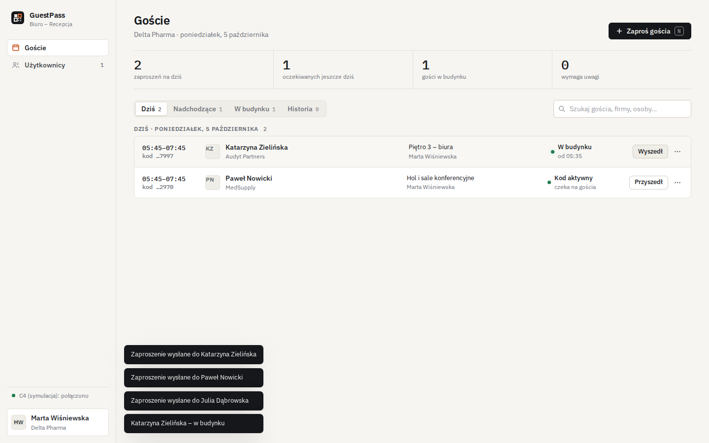
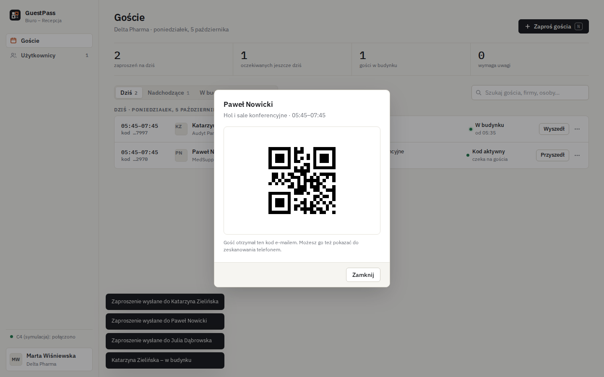

# C4 GuestPass

Aplikacja webowa do obsługi gości w budynkach z systemem kontroli dostępu **Gamanet C4**.
Firma-najemca zaprasza gościa, gość dostaje e-mailem **kod QR zamiast karty**, a aplikacja zakłada w C4
osobę z identyfikatorem (numer z QR) dokładnie na czas wizyty i usuwa ją po jej zakończeniu.
Recepcja widzi listę gości i rejestruje wejścia/wyjścia.

- wielu najemców w jednym budynku – każda firma nadaje tylko strefy przydzielone jej przez administratora budynku,
  z opcjonalnym limitem jednocześnie ważnych zaproszeń,
- osoba w C4 istnieje tylko w oknie `początek − 30 min … koniec + 30 min` (konfigurowalne) – poza nim kod QR nic nie otwiera,
- unieważnienie zaproszenia albo wymeldowanie gościa natychmiast usuwa osobę i identyfikator z C4,
- .NET 8 / ASP.NET Core, SQLite, bez zewnętrznych zależności w trybie demo (symulacja C4, poczta do plików `.eml`).

Dokumentacja:

- **[Wdrożenie na serwerze Linux](docs/WDROZENIE-LINUX.md)** – paczka z C4 SDK, instalator (systemd + HTTPS), połączenie z C4 ustawiane w przeglądarce.
- **[Instrukcja administratora budynku](docs/INSTRUKCJA-ADMINISTRATORA.md)** – konfiguracja C4 w aplikacji (wybór z list, bez GUID-ów), firmy, konta, rozwiązywanie problemów.
- **[Integracja z C4 2024 – opis techniczny](docs/INTEGRACJA-C4-2024.md)** – budowanie z SDK 21, jak aplikacja zakłada gościa, poziom dostępu i kartę w C4, test po wdrożeniu.
- **[Analiza](docs/ANALIZA.md)** – model danych C4, czytniki QR, formaty kodów, ryzyka, alternatywy.




---

## Spis treści

1. [Szybki start (demo)](#szybki-start-demo)
2. [Budowanie dla prawdziwego C4 (2024 / 2026)](#budowanie-dla-prawdziwego-c4-2024--2026)
3. [Przygotowanie po stronie C4](#przygotowanie-po-stronie-c4)
4. [Konfiguracja](#konfiguracja)
5. [Role](#role)
6. [Wdrożenie](#wdrożenie) – [Linux (zalecane)](#linux-serwer-zdalny), [Docker](#docker), [IIS](#iis-windows-server), [usługa Windows](#usługa-windows)
7. [Testy](#testy)
8. [Struktura projektu](#struktura-projektu)
9. [Bezpieczeństwo](#bezpieczeństwo)

---

## Szybki start (demo)

Wymagania: [.NET 8 SDK](https://dotnet.microsoft.com/download/dotnet/8.0). Serwer C4 ani SMTP nie są potrzebne.

```bash
dotnet run --project src/C4GuestPass.Web
```

Aplikacja startuje w środowisku `Development` (profil `http` z `launchSettings.json`) pod adresem
<http://localhost:5221>. W tym trybie:

| Element | Zachowanie |
|---|---|
| Konta | `admin` / `Admin12345!` (administrator budynku) oraz firmy demo: `acme` i `nordwave` (administratorzy firm) z tym samym hasłem – tworzone tylko przy pustej bazie (`appsettings.Development.json`). |
| C4 | `C4:Mode = Mock` – symulacja; „założenie osoby w C4” widać w logu konsoli jako `[MOCK C4] ...`. |
| Poczta | `Mail:Mode = Pickup` – zaproszenia zapisywane jako pliki `.eml` w `src/C4GuestPass.Web/data/mail/` (otwierają się w Outlooku / Thunderbirdzie). |
| Baza | `src/C4GuestPass.Web/data/guestpass.db` (SQLite). Usunięcie katalogu `data/` = czysty start. |

Ścieżka demo: zaloguj się jako `acme` → *Nowe zaproszenie* → wybierz strefę i godzinę → otwórz wygenerowany `.eml`
z kodem QR. Gdy zbliży się okno wizyty (domyślnie 30 min przed początkiem), worker „zakłada” gościa w C4
(status *Active*), po końcu okna + 30 min usuwa go (status *Expired*).

---

## Budowanie dla prawdziwego C4 (2024 / 2026)

Integracja z C4 korzysta z **Gamanet C4 Simple Client SDK** (pakiety NuGet `Gamanet.C4.SimpleClient`
i `Gamanet.C4.SimpleInterfaces`). Wersja SDK musi odpowiadać wersji serwera C4 i jest wybierana przełącznikiem
MSBuild `C4SdkVersion`:

```bash
dotnet build                          # None – bez SDK, dostępny tylko tryb Mock (domyślnie)
dotnet build -p:C4SdkVersion=2024     # serwer C4 2024
dotnet build -p:C4SdkVersion=2026     # serwer C4 2026

# konkretna wersja pakietów zamiast najnowszej z danej linii
dotnet build -p:C4SdkVersion=2024 -p:C4SdkPackageVersion=2024.0.0.512
```

Ten sam przełącznik obowiązuje dla `dotnet publish`, obrazu Docker (`--build-arg C4_SDK_VERSION=2024`)
i skryptu Windows (`-C4SdkVersion 2024`).

**C4 2024 (serwer 21.0) – sprawdzone.** Wariant `2024` bierze pakiet `Gamanet.C4.SimpleClient` **21.0.10657.17457**
z lokalnej instalacji C4 SDK (`C:\Program Files (x86)\Gamanet\C4 SDK`; inny katalog: `-p:C4SdkLocalFeed=...`),
bez feedu online. SDK jest skompilowane pod .NET Framework 4.6.1, ale to czysty kod zarządzany bez zależności
od Windows – działa w .NET 8 **na Windows i na Linuksie** (sprawdzone: Ubuntu 24.04 ↔ C4 21.0), łącząc się z serwerem C4
przez HTTPS. Konektory SDK są kopiowane do `Connectors/` obok aplikacji.
Paczkę dla Linuksa buduje `deploy\build-linux.ps1` – patrz [Wdrożenie na Linuksie](docs/WDROZENIE-LINUX.md).
`C4:ServerUri` to adres **bez** `/c4` (np. `https://c4server.firma.local`) – SDK dokleja ścieżkę samo.

Wymagania (wariant `2026`):

- **licencja deweloperska Gamanet** i dostęp do feedu NuGet **`https://nugets.c4portal.com/nuget`**
  (dodawany automatycznie przez `RestoreAdditionalProjectSources`; inny adres: `-p:C4NuGetFeed=...`),
- jeśli feed wymaga logowania – poświadczenia w `nuget.config` użytkownika, np.
  `dotnet nuget add source https://nugets.c4portal.com/nuget -n gamanet -u <login> -p <hasło> --store-password-in-clear-text`
  (na Windows bez ostatniej flagi – hasło trafi do DPAPI),
- w konfiguracji `C4:Mode = SimpleClient`. Aplikacja zbudowana bez SDK, a uruchomiona z `Mode = SimpleClient`,
  zatrzyma się przy starcie z czytelnym komunikatem.

> **C4 2024 – zweryfikowane na serwerze 21.0.** Cały kod zależny od SDK jest w jednym pliku
> `src/C4GuestPass.Web/C4/SimpleClientC4Gateway.cs`; szczegóły (osoba, poziom dostępu przez `PersonRef`, karta,
> usuwanie) w [docs/INTEGRACJA-C4-2024.md](docs/INTEGRACJA-C4-2024.md). Wariant 2026 nie był testowany.
> Stan połączenia sprawdza endpoint `GET /api/health` (po zalogowaniu).

---

## Przygotowanie po stronie C4

Aplikacja zakłada gościa w folderze osób, przypisuje mu **poziomy dostępu** C4 i identyfikator z kodem QR.
Samych poziomów dostępu (które drzwi, w jakich godzinach) nie tworzy – przygotowuje je administrator C4:

1. **Foldery osób dla gości** (np. `Goście/Hol`, `Goście/Parking`) oraz **poziomy dostępu** (np. `visitor`)
   z przypisanymi drzwiami. C4 nie pozwala przypiąć poziomu dostępu do folderu – aplikacja przypisuje go
   każdemu gościowi osobno i zdejmuje razem z usunięciem gościa.
   Wszystko to wybiera się potem z list w aplikacji: **Konfiguracja C4** (administrator budynku) – rodzaj
   identyfikatora i typ karty, poziomy dostępu dla każdego gościa, strefy (folder + dodatkowe poziomy dostępu).
   Gdy firma potrzebuje osobnego folderu (np. `Goście/ACME`), wybiera się go przy strefie firmy w zakładce *Firmy*.
2. **Konto techniczne (operator) dla aplikacji**, np. `svc-guestpass`: prawo tworzenia, edycji i usuwania osób
   oraz identyfikatorów **tylko w folderach gości**. Bez uprawnień administracyjnych do konfiguracji systemu.
3. **Typ identyfikatora** zgodny z tym, co wysyła czytnik: zwykle numer karty (włączony typ karty w C4,
   np. 48-bitowy dla 12-cyfrowego kodu); dla czytników przekazujących kod jako PIN – PIN. Wybór w *Konfiguracji C4*.
4. **Czytniki QR** przy drzwiach objętych strefami gości, np. **2N Access Unit QR** albo inne czytniki
   QR z wyjściem Wiegand / OSDP podłączone do kontrolerów C4. Czytnik dekoduje tekst z QR i przekazuje
   liczbę do kontrolera jak numer karty. Sprawdź:
   - maksymalną długość numeru (Wiegand 26 bit ≈ 5 cyfr znaczących, 34 bit ≈ 10 cyfr, 2N: 4–15 cyfr)
     i dobierz `GuestPass:CodeDigits`,
   - czy czytnik wymaga prefiksu w treści QR (`GuestPass:QrPayloadPrefix`),
   - odczyt z ekranu telefonu (jasność, odblaski) – aplikacja generuje QR z korekcją błędów poziomu Q.
5. **Łączność**: serwer aplikacji musi widzieć serwer C4 (`C4:ServerUri`, connector `Http` – działa również
   na Linuksie/w kontenerze; `Tcp` – opcjonalnie). Czas serwera aplikacji i C4 zsynchronizowany (NTP).

---

## Konfiguracja

Źródła (późniejsze nadpisują wcześniejsze): `appsettings.json` → `appsettings.{Environment}.json` →
zmienne środowiskowe → argumenty wiersza poleceń. W zmiennych środowiskowych separator sekcji to
**podwójne podkreślenie**: `C4__Password`, `Mail__Host`, `C4__AccessProfiles__0__Name`.
Pełny przykład produkcyjny: [`deploy/appsettings.Production.example.json`](deploy/appsettings.Production.example.json).

Ścieżki względne (`DatabasePath`, `PickupDirectory`) są liczone od **bieżącego katalogu procesu** –
w usłudze Windows i w IIS podawaj ścieżki bezwzględne.

### `GuestPass`

| Klucz | Domyślnie | Opis |
|---|---|---|
| `SiteName` | `Recepcja` | Nazwa budynku/recepcji w UI i w treści e-maila. |
| `DatabasePath` | `data/guestpass.db` | Plik bazy SQLite. Katalog tworzony automatycznie. |
| `ActivateMinutesBefore` | `30` | Ile minut przed początkiem wizyty osoba pojawia się w C4. |
| `DeactivateMinutesAfter` | `30` | Ile minut po końcu wizyty osoba jest jeszcze w C4. |
| `MaxVisitHours` | `72` | Maksymalna długość jednej wizyty. |
| `CodeDigits` | `12` | Liczba cyfr kodu (dopasuj do czytników – patrz wyżej). |
| `QrPayloadPrefix` | `""` | Prefiks dodawany do treści QR (gdy czytnik tego wymaga). |
| `WorkerIntervalSeconds` | `30` | Co ile sekund worker zakłada/usuwa gości w C4. |
| `MaxProvisionAttempts` | `10` | Po tylu nieudanych próbach założenia gościa w C4 worker przestaje ponawiać (błąd widoczny przy wizycie). |
| `RetentionDays` | `90` | RODO: po tylu dniach od końca zakończonej wizyty dane gościa są usuwane z bazy (0 = nie usuwać). |
| `SecureCookies` | `true` | Ciasteczko sesji tylko po HTTPS. `false` wyłącznie w Development. |
| `LoginAttemptsPerMinute` | `10` | Limit prób logowania na adres IP na minutę (HTTP 429 po przekroczeniu). |

### `C4`

| Klucz | Domyślnie | Opis |
|---|---|---|
| `Mode` | `Mock` | `Mock` – symulacja; `SimpleClient` – prawdziwy serwer (wymaga builda z `C4SdkVersion`). |
| `ServerUri` | – | Adres serwera C4, np. `https://c4server.firma.local`. |
| `User` | – | Operator techniczny C4 (minimalne uprawnienia, patrz wyżej). |
| `Password` | – | Hasło operatora – **tylko** przez zmienną `C4__Password` / sekret, nie w repozytorium. |
| `Connector` | `Http` | Nieużywane od SDK 21 (C4 2024) – jedynym konektorem jest REST. |
| `CredentialType`, `CardTypeId`, `AccessLevelIds[]`, `AccessProfiles[]` | – | **Tylko wartości startowe.** Rodzaj identyfikatora, typ karty, poziomy dostępu dla każdego gościa i strefy ustawia administrator budynku w aplikacji (*Konfiguracja C4*, wybór z list pobranych z C4). Po pierwszym zapisie w aplikacji obowiązują ustawienia z bazy, a te klucze są ignorowane. |

### `Mail`

| Klucz | Domyślnie | Opis |
|---|---|---|
| `Mode` | `Pickup` | `Pickup` – pliki `.eml` w `PickupDirectory`; `Smtp` – wysyłka. |
| `PickupDirectory` | `data/mail` | Katalog dla trybu `Pickup`. |
| `Host`, `Port` | –, `587` | Serwer SMTP. |
| `UseStartTls` | `true` | `true` – STARTTLS (port 587); `false` – automatycznie (np. SSL na 465). |
| `User`, `Password` | – | Logowanie SMTP (puste `User` = bez uwierzytelniania, np. relay wewnętrzny). Hasło: `Mail__Password`. |
| `FromAddress`, `FromName` | `recepcja@example.com`, `Recepcja` | Nadawca; w wiadomości wyświetla się jako „*Firma* via *FromName*”. |

### `Bootstrap` (pierwsze uruchomienie)

| Klucz | Domyślnie | Opis |
|---|---|---|
| `AdminLogin` | `admin` | Login administratora budynku tworzonego, gdy baza nie ma żadnych kont. |
| `AdminPassword` | `""` | Puste (zalecane w produkcji) = losowe hasło tymczasowe wypisane w logu (poziom Warning), zmiana wymuszana przy pierwszym logowaniu. |
| `SeedDemoData` | `false` | Firmy i konta demonstracyjne (`acme`, `nordwave`). W produkcji `false`. |

---

## Role

| Rola | Kto | Może |
|---|---|---|
| `BuildingAdmin` | administrator budynku / recepcja główna | zarządza firmami (aktywność, przydzielone strefy, foldery C4, limit gości) i wszystkimi kontami; widzi i obsługuje wizyty wszystkich firm (zaproszenia, wejście/wyjście, unieważnienie). |
| `CompanyAdmin` | administrator firmy-najemcy | zarządza kontami swojej firmy (`CompanyAdmin`, `Host`), zaprasza gości do stref przydzielonych firmie, widzi wizyty swojej firmy. |
| `Host` | pracownik firmy | zaprasza gości w imieniu firmy, widzi i obsługuje wizyty swojej firmy. |

Konta tworzone są z hasłem tymczasowym (do zmiany przy pierwszym logowaniu). Zmiana hasła, roli lub
dezaktywacja konta/firmy unieważnia aktywne sesje.

---

## Wdrożenie

Aplikacja to **jedna instancja** z lokalną bazą SQLite i wbudowanym workerem – nie uruchamiaj kilku kopii
na tej samej bazie i nie skaluj jej poziomo. Worker musi działać stale: od niego zależy założenie gościa
w C4 przed wizytą i **usunięcie go po wizycie**.

Pliki wdrożeniowe:

| Plik | Do czego |
|---|---|
| `deploy/build-linux.ps1` | paczka `.tar.gz` dla serwera Linux (samodzielna, z C4 SDK) |
| `deploy/linux/install.sh` | instalator na serwerze: usługa systemd, katalogi, opcjonalnie Caddy z HTTPS |
| `deploy/linux/c4guestpass.service`, `c4guestpass.env.example`, `nginx.conf` | usługa systemd, wzór konfiguracji, wzór dla istniejącego nginx |
| `deploy/prepare-c4-sdk.ps1` | kopiuje pakiety C4 SDK do `deploy/c4-sdk/` (do budowania obrazu Docker z C4 2024) |
| `deploy/Dockerfile` | obraz Linux (multi-stage SDK → aspnet:8.0, użytkownik bez roota, port 8080) |
| `deploy/docker-compose.yml` | aplikacja + opcjonalny Caddy z HTTPS (profil `https`) |
| `deploy/Caddyfile` | konfiguracja reverse proxy |
| `deploy/.env.example` | wersja SDK i sekrety dla `docker compose` |
| `deploy/appsettings.Production.example.json` | pełny przykład konfiguracji produkcyjnej |
| `deploy/windows/install-service.ps1`, `uninstall-service.ps1` | usługa Windows (wymaga zmiany w kodzie – patrz niżej) |

### Linux (serwer zdalny)

Zalecany sposób: program na serwerze Linux, obsługa wyłącznie przez przeglądarkę, połączenie z C4 przez sieć.
Krok po kroku: **[docs/WDROZENIE-LINUX.md](docs/WDROZENIE-LINUX.md)**.

```powershell
powershell -ExecutionPolicy Bypass -File deploy\build-linux.ps1          # Windows z C4 SDK -> dist\c4guestpass-linux-x64.tar.gz
```
```bash
tar xzf c4guestpass-linux-x64.tar.gz && cd c4guestpass-linux-x64
sudo bash install.sh --domain guestpass.firma.pl                       # usługa systemd + Caddy z HTTPS
```

Adres serwera C4, login i hasło ustawia potem administrator budynku w **Konfiguracja C4 → Połączenie z C4**.
Hasło jest zapisywane w bazie w postaci zaszyfrowanej.

### Docker

Demo jednym poleceniem (Mock C4, poczta do wolumenu):

```bash
docker build -f deploy/Dockerfile -t c4guestpass .
docker run --rm -p 8080:8080 -e Bootstrap__AdminPassword='Demo12345!' -e Bootstrap__SeedDemoData=true c4guestpass
```

Produkcja:

```bash
cd deploy
cp .env.example .env                                               # C4_SDK_VERSION, hasła
cp appsettings.Production.example.json appsettings.Production.json  # serwer C4, strefy, SMTP
docker compose up -d --build                                       # aplikacja na :8080
docker compose --profile https up -d --build                       # + Caddy (HTTPS) na :80/:443
docker compose logs app | grep -i hasło                            # hasło startowe administratora
```

- Obraz z SDK: `C4_SDK_VERSION=2024` (lub `2026`) w `.env`. Feed Gamanet z logowaniem: odkomentuj `secrets`
  w `docker-compose.yml` (nuget.config z poświadczeniami przekazywany jako sekret BuildKit, nie trafia do obrazu).
- W `docker-compose.yml` zmienne środowiskowe zawierają **tylko sekrety** – każda zmienna ustawiona w compose
  (nawet pusta) wygrywa z `appsettings.Production.json`.
- Wolumeny: `guestpass-data` (`/app/data` – baza i poczta Pickup) oraz `guestpass-keys` (klucze Data Protection –
  bez nich każdy restart kontenera wylogowuje użytkowników). Przy bind-mouncie zamiast wolumenu nadaj
  katalogowi właściciela UID `1654` (użytkownik `app` z obrazu).
- `ASPNETCORE_FORWARDEDHEADERS_ENABLED=true` – aplikacja respektuje `X-Forwarded-Proto` od Caddy, dzięki czemu
  ciasteczko sesji dostaje flagę `Secure`. Przy profilu `https` nie wystawiaj portu 8080 na zewnątrz
  (`127.0.0.1:8080:8080` albo usuń mapowanie).
- Caddy: domena publiczna → certyfikat Let's Encrypt; sieć wewnętrzna → `tls internal` lub własny certyfikat
  (komentarze w `deploy/Caddyfile`).
- Kontener musi rozwiązywać nazwę serwera C4 i SMTP (wewnętrzny DNS albo `extra_hosts`).
- Kopia zapasowa: w obrazie nie ma `sqlite3`, więc najprościej zatrzymać aplikację (`docker compose stop app`)
  i skopiować plik bazy z wolumenu (`guestpass.db` + ewentualne `-wal`/`-shm`), np.
  `docker run --rm -v c4guestpass_guestpass-data:/d -v "$PWD":/b alpine cp -a /d /b/backup`.

### IIS (Windows Server)

Zalecany sposób na Windows – nie wymaga zmian w kodzie (`dotnet publish` generuje `web.config` dla ASP.NET Core Module).

1. Zainstaluj **ASP.NET Core 8.0 Hosting Bundle** i moduł IIS **Application Initialization**.
2. Opublikuj:
   ```powershell
   dotnet publish src\C4GuestPass.Web -c Release -p:C4SdkVersion=2024 -o C:\inetpub\c4guestpass
   Remove-Item C:\inetpub\c4guestpass\appsettings.Development.json
   ```
3. Utwórz `C:\inetpub\c4guestpass\appsettings.Production.json` na bazie
   `deploy\appsettings.Production.example.json`, z **bezwzględnymi** ścieżkami danych poza katalogiem witryny,
   np. `"DatabasePath": "C:\\ProgramData\\C4GuestPass\\guestpass.db"`,
   `"PickupDirectory": "C:\\ProgramData\\C4GuestPass\\mail"`. Hasła możesz zamiast tego podać w `web.config`
   (`<environmentVariables>` w `<aspNetCore>`) – pamiętaj, że kolejny `publish` nadpisze `web.config`.
4. Pula aplikacji – ustawienia **krytyczne** dla workera (domyślnie IIS wyłącza bezczynną aplikację po 20 min,
   wtedy goście nie są zakładani ani usuwani z C4):
   ```powershell
   Import-Module WebAdministration
   New-WebAppPool C4GuestPass
   $p = 'IIS:\AppPools\C4GuestPass'
   Set-ItemProperty $p managedRuntimeVersion ''                    # No Managed Code
   Set-ItemProperty $p startMode AlwaysRunning
   Set-ItemProperty $p processModel.idleTimeout ([TimeSpan]::Zero)
   Set-ItemProperty $p processModel.loadUserProfile $true          # klucze Data Protection w profilu
   Set-ItemProperty $p recycling.periodicRestart.time ([TimeSpan]::Zero)
   Set-ItemProperty $p recycling.disallowOverlappingRotation $true # jedna instancja na bazie SQLite
   New-Website C4GuestPass -PhysicalPath C:\inetpub\c4guestpass -ApplicationPool C4GuestPass -Port 443 -Ssl -HostHeader guestpass.firma.pl
   Set-ItemProperty IIS:\Sites\C4GuestPass applicationDefaults.preloadEnabled $true
   ```
   Następnie przypisz certyfikat do powiązania HTTPS (Menedżer IIS lub `New-WebBinding`/`netsh http add sslcert`).
5. Uprawnienia: `IIS AppPool\C4GuestPass` – Modyfikacja na `C:\ProgramData\C4GuestPass`, odczyt na katalogu witryny;
   `appsettings.Production.json` dostępny tylko dla Administratorów, SYSTEM i tożsamości puli.
6. Logi startowe (np. hasło administratora): Podgląd zdarzeń → Aplikacja (źródło *IIS AspNetCore Module V2*)
   albo tymczasowo `stdoutLogEnabled="true"` w `web.config`.

### Usługa Windows

`deploy/windows/install-service.ps1` publikuje aplikację jako self-contained `win-x64`
(`-C4SdkVersion None|2024|2026`), instaluje ją jako usługę z kontem wirtualnym `NT SERVICE\C4GuestPass`,
startem *automatycznym (opóźnionym)*, restartem po awarii, zmiennymi środowiskowymi usługi
(`ASPNETCORE_URLS`, bezwzględne ścieżki do `C:\ProgramData\C4GuestPass`), ograniczonym dostępem do
`appsettings.Production.json` w katalogu instalacji i opcjonalną regułą zapory (`-OpenFirewall`).

> Aplikacja ma wbudowaną obsługę usługi Windows (`UseWindowsService`, content root = katalog aplikacji,
> ścieżki względne liczone od katalogu aplikacji).
> Usługa nasłuchuje po HTTP (domyślnie :8080) – w produkcji postaw przed nią HTTPS (IIS + ARR, reverse proxy).

```powershell
# PowerShell jako Administrator, w katalogu repozytorium
.\deploy\windows\install-service.ps1 -C4SdkVersion 2024 -Port 8080 -OpenFirewall
.\deploy\windows\uninstall-service.ps1                       # usługa + reguła zapory
.\deploy\windows\uninstall-service.ps1 -RemoveFiles -RemoveData
```

Przed odinstalowaniem unieważnij aktywne wizyty (albo usuń gości z folderów w C4) – bez działającej
aplikacji nikt ich z C4 nie usunie.

---

## Testy

```bash
dotnet test
```

Testy (xUnit) działają na trybie Mock z kontrolowanym zegarem i nie wymagają C4 ani SMTP:
`VisitServiceTests` – cykl życia wizyty (obecność w C4 tylko w oknie czasowym, natychmiastowe usunięcie przy
wymeldowaniu/unieważnieniu, ponawianie po błędzie C4, błąd poczty, limit firmy, izolacja firm, walidacja,
generator kodów, QR); `ApiTests` – API przez `WebApplicationFactory` (wymagane logowanie i nagłówek CSRF,
pełny przepływ: administrator tworzy firmę i konto, pracownik zaprasza gościa).
Kompilację wariantu z SDK sprawdzisz poleceniem `dotnet build -p:C4SdkVersion=2024` (wymaga dostępu do feedu).

---

## Struktura projektu

```
C4GuestPass.sln
├── src/C4GuestPass.Web/               aplikacja ASP.NET Core (.NET 8)
│   ├── Program.cs                     DI, uwierzytelnianie (cookie), middleware, minimal API /api/*
│   ├── Options.cs                     sekcje konfiguracji: GuestPass, C4, Mail, Bootstrap
│   ├── appsettings*.json
│   ├── Auth/UserService.cs            konta, role, firmy, bootstrap administratora i danych demo
│   ├── C4/
│   │   ├── IC4Gateway.cs              jedyny punkt styku z C4
│   │   ├── MockC4Gateway.cs           symulacja (demo, testy)
│   │   └── SimpleClientC4Gateway.cs   Gamanet Simple Client SDK (kompilowany tylko z C4SdkVersion)
│   ├── Data/                          SQLite: Database, VisitStore, TenancyStore
│   ├── Domain/                        Visit, Company, AppUser, role
│   ├── Services/                      VisitService + ProvisioningWorker, GuestMailer, QrRenderer, AccessCodeGenerator
│   └── wwwroot/                       UI (HTML/CSS/JS bez frameworka, fonty IBM Plex)
├── tests/C4GuestPass.Tests/           xUnit
├── deploy/                            Dockerfile, docker-compose, Caddyfile, przykład konfiguracji, skrypty Windows
└── docs/                              ANALIZA.md, zrzuty ekranu
```

---

## Bezpieczeństwo

- **Sekrety** (`C4__Password`, `Mail__Password`, `Bootstrap__AdminPassword`) podawaj przez zmienne środowiskowe,
  sekrety kontenera lub plik `appsettings.Production.json` z ograniczonym ACL – nigdy w repozytorium
  (`appsettings.Production.json` i `deploy/.env` są w `.gitignore`). Lokalnie: `dotnet user-secrets`.
- **Konto C4** aplikacji: osobny operator z prawami wyłącznie do folderów gości. Aplikacja nie nadaje uprawnień
  do drzwi – zakres dostępu gościa wynika z folderu, który przygotował administrator C4.
- **HTTPS obowiązkowo** w produkcji (Caddy / IIS). Ciasteczko sesji: `HttpOnly`, `SameSite=Strict`,
  zawsze `Secure` (`GuestPass:SecureCookies=true`, wyłączone tylko w Development). Aplikacja obsługuje nagłówki `X-Forwarded-For/Proto`
  od reverse proxy (prawidłowy adres IP klienta dla limitu logowań).
- **Kod QR to klucz.** Kod jest losowy (`CodeDigits` cyfr), wysyłany tylko e-mailem i w UI pokazywany w formie
  maskowanej. Działa wyłącznie w oknie wizyty, bo poza nim osoba nie istnieje w C4 – stąd znaczenie działającego
  workera i synchronizacji czasu. Zgubiony/przekazany kod → *Unieważnij* (natychmiastowe usunięcie z C4).
- **Pierwsze uruchomienie:** zostaw `Bootstrap:AdminPassword` puste – hasło tymczasowe pojawi się raz w logu
  i trzeba je zmienić przy pierwszym logowaniu. `SeedDemoData` w produkcji zawsze `false`;
  obraz Docker i skrypt Windows usuwają `appsettings.Development.json` z publikacji.
- **Ochrona API:** żądania modyfikujące wymagają nagłówka `X-Requested-With: fetch` (CSRF). Logowanie:
  opóźnienie przy błędnym haśle + limit prób na adres IP (`GuestPass:LoginAttemptsPerMinute`, domyślnie 10/min,
  odpowiedź 429). Konta nie są blokowane po N próbach (to ułatwiałoby blokowanie cudzych kont).
- **Dane osobowe (RODO):** baza zawiera imiona, nazwiska, e-maile i telefony gości. Zakończone wizyty są
  usuwane automatycznie po `GuestPass:RetentionDays` dniach (domyślnie 90; 0 = wyłączone). Zabezpiecz też
  kopie zapasowe katalogu `data/` – kopie podlegają tej samej retencji.
- **Klucze Data Protection** (szyfrują ciasteczka i hasło C4 zapisane w aplikacji) są w katalogu `keys/` obok bazy
  (`GuestPass:KeysDirectory`, aby zmienić). Na Windows są dodatkowo chronione DPAPI maszyny, na Linuksie prawami katalogu (`700`).
  Kopia zapasowa musi obejmować bazę **i** `keys/`.
