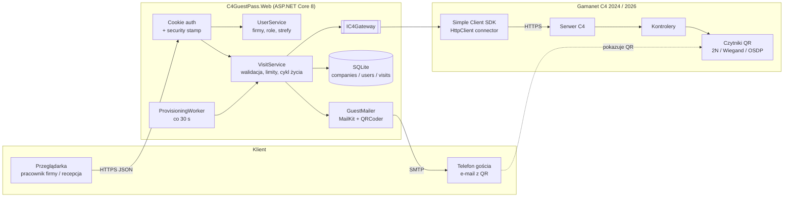
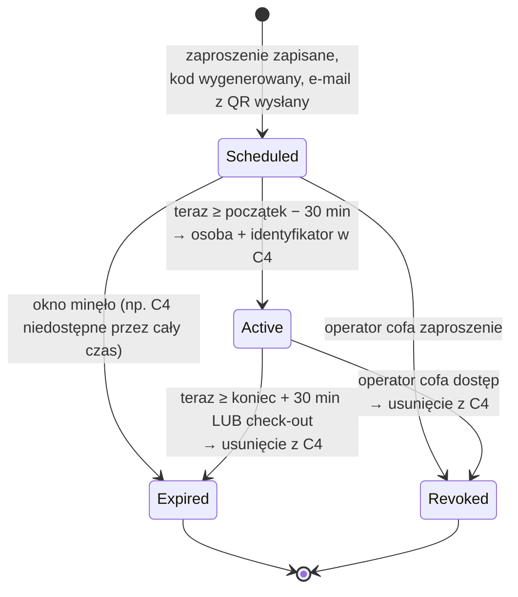

# Goście z kodem QR w systemie Gamanet C4: analiza techniczna

**Przedmiot:** klient WWW, w którym firmy-najemcy budynku zapraszają gości. Gość zamiast karty dostaje e-mailem kod QR, który otwiera drzwi obsługiwane przez system kontroli dostępu Gamanet C4.
**Wymagana kompatybilność:** Gamanet C4 2024 i nowsze (w tym 2026).
**Produkt referencyjny:** `src/C4GuestPass.Web` (ASP.NET Core 8) w tym repozytorium.
**Data:** październik 2026

---

## 1. Streszczenie

**Czy to wykonalne? Tak.** C4 traktuje kod QR tak samo jak każdy inny identyfikator (numer karty lub PIN). Czytnik z kamerą QR dekoduje obraz i wysyła do kontrolera liczbę, tak samo jak po przyłożeniu karty. Wystarczy więc założyć w C4 osobę-gościa, przypisać jej identyfikator o wartości zapisanej w QR i umieścić ją tam, gdzie obowiązują uprawnienia do właściwych drzwi. Że to podejście jest w C4 natywne, potwierdza sam Gamanet: jego moduł *Smart Reception* (C4 Smart Office) robi dokładnie to samo jako produkt komercyjny.

**Rekomendowane podejście:**

| Element | Decyzja |
|---|---|
| Integracja z C4 | **Gamanet C4 Simple Client SDK** (pakiety NuGet `Gamanet.C4.SimpleClient` i `Gamanet.C4.SimpleInterfaces`, netstandard2.0), w wersji zgodnej z serwerem: 2024 albo 2026 |
| Backend | ASP.NET Core 8, ponieważ SDK jest biblioteką .NET. Przeglądarka nigdy nie łączy się z C4 bezpośrednio |
| Model uprawnień | Administrator C4 zakłada **folder osób na każdą strefę** i nadaje mu uprawnienia do drzwi. Aplikacja tylko dodaje gości do folderu, a gość dziedziczy uprawnienia folderu |
| Ważność kodu | **Provisioning „just-in-time”**: osoba i identyfikator istnieją w C4 wyłącznie w oknie `[początek − 30 min, koniec + 30 min]`, a potem aplikacja je usuwa |
| Kod QR | Losowa liczba z CSPRNG, domyślnie 12 cyfr (konfigurowalna pod czytnik), ECC poziomu Q |
| Wielofirmowość | Role BuildingAdmin, CompanyAdmin i Host. Firma może nadawać gościom wyłącznie strefy przydzielone jej przez administratora budynku |

**Co zbudowano:** działającą aplikację WWW. Obejmuje ona logowanie, firmy, konta, przydział stref, limity, zaproszenia, wysyłkę e-maila z QR, check-in i check-out, ręczne cofanie dostępu oraz workera w tle, który aktywuje i wygasza dostęp. Całą komunikację z C4 przechodzi przez interfejs `IC4Gateway`. Ma on dwie implementacje: `MockC4Gateway` (demo i testy bez serwera) oraz `SimpleClientC4Gateway` (prawdziwe SDK, wybór wersji przełącznikiem MSBuild `-p:C4SdkVersion=2024|2026`).

**Co trzeba zweryfikować na prawdziwym serwerze C4 2024.** Oficjalna wiki `wiki.gamanet.com` była z naszego środowiska zablokowana, dlatego część nazw w SDK pochodzi z fragmentów stron wyszukiwarki, a nie z pełnej dokumentacji. W jednym pliku, `C4/SimpleClientC4Gateway.cs`, jest 5 miejsc oznaczonych `VERIFY`, które trzeba sprawdzić w dokumentacji SDK otrzymanej z licencją deweloperską:
1. dodatkowe pola osoby w `SimplePersonV1` (imię, nazwisko, firma, ewentualnie ważność),
2. klasa identyfikatora `CredentialV1` i jej pola (wartość, typ),
3. nazwa repozytorium identyfikatorów (`client.Credentials`?) albo model „identyfikatory jako kolekcja osoby”,
4. sygnatury `Delete` (przez `Guid` czy przez encję),
5. nazwa `ConnectorConfiguration.TcpClient`.

Szacowany nakład weryfikacji i poprawek po otrzymaniu SDK: **1–3 dni** pracy dewelopera .NET z dostępem do testowego serwera C4.

---

## 2. Źródła i poziom pewności

> **Ważne ograniczenie:** hosty `wiki.gamanet.com`, `gamanet.com`, `web.archive.org` i wyszukiwarka NuGet były zablokowane przez politykę sieciową środowiska analizy (błąd CONNECT 403 / EGRESS_BLOCKED). Wnioski o SDK pochodzą z **fragmentów stron wiki zwracanych przez wyszukiwarkę** (tytuły, adresy, krótkie wycinki treści) oraz z **publicznego, prawdziwego kodu** korzystającego z Simple Client. Tam, gdzie wniosek jest wnioskowaniem, a nie cytatem, zaznaczamy to.

| # | Źródło | Co z niego wiemy | Pewność |
|---|---|---|---|
| S1 | Dokumentacja referencyjna SDK (Sandcastle): `https://wiki.gamanet.com/sdkdoc/html/R_Project.htm` | Przestrzenie nazw `Gamanet.C4`, `.Attendance`, `.DriverFramework(.AccessControl.Biometric, .Alarms, .Communication)`, `.Logging`, `.Security` | Wysoka (tytuły i struktura) |
| S2 | C4 SDK 2015, rozdz. „3. First Steps” (`https://wiki.gamanet.com/a/1622`) i „4. Access Control Management” (`https://wiki.gamanet.com/a/1625`) | Moduł AC dla sterowników. **C4 wysyła do urządzenia tylko dozwolone identyfikatory.** Zdarzenie `DeviceEvent.AccessGranted(IIngressPoint, IIdentityReader, PersonHandle, [IdentifierHandle])` trafia do audytu | Wysoka (wycinki treści). To dokumentacja strony sterownika, nie klienta |
| S3 | Strony „C4 SDK Transformers / Simple Client / Simple Client SDK 2026”, przestrzeń `Gamanet.C4.SimpleInterfaces` (np. `https://wiki.gamanet.com/a/45734`, klasa `LicenseAssignmentV1`; `https://wiki.gamanet.com/a/45066`, `SimpleClient.Profiles`) | Simple Client to „nowa generacja SDK”, z której korzystają również deweloperzy Gamanet. Wersje 2023.0, 2024.0, 2025 i 2026. Pakiet obejmuje dokumentację, licencję deweloperską i wsparcie. Klasa `SimpleClient` z przeciążeniami `Connect(Uri, user, pwd/SecureString, ConnectionInfoV1)` oraz wariantem z callbackiem. Klasy `SimplePersonV1`, `EntityRoot`, `EntityDefinitionV1/V2`; repozytorium `ISimpleClientPersonRepositoryV3`; klasa `CredentialV1` pojawia się w dokumentacji 2023.0, 2024.0 i 2025 | Wysoka co do istnienia typów, **niska co do ich pól** |
| S4 | Feed NuGet `nugets.c4portal.com` oraz PDF-y z `c4portal.com` (How_to_Start_Development_EN.pdf, Initial_Steps_for_Driver_Development_EN.pdf, C4_Quick Guide_EN.pdf) | Pakiety SDK są dystrybuowane przez prywatny feed Gamanet. Dostęp ma deweloper z licencją | Średnia (wzmianki, treści PDF nie czytaliśmy) |
| S5 | **Publiczne repozytorium `github.com/lava-dev/TreeList`** (pliki `App.xaml.cs`, `Hosters/SimpleClientHoster.cs`, `DataSources/SimpleClientDataProvider.cs`, `ServerJob_WpfApp1.csproj`, `packages.config`) | **Prawdziwy kod** z SDK `Gamanet.C4.SimpleClient 2023.0.0.692-beta` i `Gamanet.C4.SimpleInterfaces 2023.0.0.110-beta`. Biblioteki w `lib/netstandard2.0`. Konektory DataCache, PipeClient, SapiClient, TcpClient, a także `ConnectorConfiguration.HttpClient`. Wzorzec `Connect(Uri, user, pwd, out info) == ConnectionResult.Successful`. Repozytoria `Persons.GetAll(EntityRoot.PersonSuperRoot, Properties.None, false)`, `Permissions.Create/Update/Delete(PermissionV1)`, `Permissions.Filter(...)`, `Calendars.GetAll()`, `EntityDefinitions.GetAll()`. Wyjątek `ValidationException` | **Bardzo wysoka** (kompilujący się kod) |
| S6 | Materiały marketingowe Gamanet: C4 obsługuje „mobile & QR codes”, moduł **Smart Reception** (C4 Smart Office) | Gość dostaje QR, uprawnienia są nadawane dynamicznie do wybranych przejść i są ważne tylko w czasie wizyty | Wysoka (deklaracja producenta) |
| S7 | Dokumentacja 2N (Access Unit QR, IP Style; integration hub `gamanet_c4`) | QR jako statyczny kod 4–15 cyfr (dziesiętnie lub hex), traktowany przez urządzenie jak PIN (10–15 cyfr). Integracja 2N z C4 wymaga firmware 2N ≥ 2.33 i C4 ≥ 2019 | Wysoka |
| S8 | Sharry (`https://sharry.tech/integrations/c4`) | Komercyjna integracja z C4 (C4 2019 SP1 – 2022 SP1): mobilne identyfikatory, przepustki QR, karty Wallet | Wysoka (strona producenta) |
| S9 | Kod aplikacji `src/C4GuestPass.Web` | Implementacja opisana w tym dokumencie | Pewne (to nasz kod), ale fragmenty `VERIFY` nie zostały uruchomione na prawdziwym C4 |

**Podsumowanie pewności:**
- **Potwierdzone:** sposób łączenia się z C4 przez Simple Client, repozytoria Persons, Permissions i Calendars, drzewo osób, netstandard2.0, wersje SDK 2024 i 2026, natywne wsparcie QR w ekosystemie C4.
- **Założone, do weryfikacji:** jak dokładnie w API Simple Client zapisuje się identyfikator (karta lub PIN) osoby i czy osoba ma pola ważności od–do.

---

## 3. Jak C4 traktuje identyfikatory i dlaczego QR działa

### 3.1 QR to tylko inny nośnik numeru

```
 ┌──────────┐  obraz QR   ┌──────────────┐  liczba (np. 483920175266)   ┌────────────┐  zdarzenia   ┌─────────┐
 │ telefon  │ ──────────► │ czytnik QR   │ ───────────────────────────► │ kontroler  │ ◄──────────► │ serwer  │
 │ gościa   │             │ (kamera)     │  Wiegand / OSDP / IP API     │ (lista ID) │              │   C4    │
 └──────────┘             └──────────────┘  jak numer karty lub PIN     └────────────┘              └─────────┘
```

- Czytnik z kamerą (2N Access Unit QR, czytniki Wiegand/OSDP z modułem 2D) dekoduje tekst z QR i **wysyła go jako numer identyfikatora** tym samym kanałem co odczyt karty.
- Kontroler (lub C4) porównuje numer z listą dozwolonych identyfikatorów. Według S2 **C4 wysyła do urządzeń wyłącznie dozwolone identyfikatory** (mniej pamięci, krótszy upload). Wynika z tego, że usunięcie identyfikatora z C4 powoduje jego usunięcie z kontrolerów, czyli kod przestaje działać, gdy C4 zsynchronizuje urządzenie.
- Każde przejście jest audytowane zdarzeniem `DeviceEvent.AccessGranted(ingressPoint, reader, PersonHandle, IdentifierHandle)`. W historii C4 widać więc *którą osobą* (gościem) i *którym identyfikatorem* (kodem QR) otwarto *które drzwi*.

### 3.2 Model danych w C4 istotny dla gości

```
EntityRoot.PersonSuperRoot
 └─ Goście                         (folder)
     ├─ Goście – Hol               (folder; uprawnienia: wejście główne, windy, sale 0.1–0.4)
     │    ├─ Kowalski Jan [gość ACME]          ◄─ osoba utworzona przez aplikację
     │    │    └─ identyfikator: Card 483920175266   ◄─ wartość z QR
     │    └─ ...
     ├─ Goście – Piętro 2          (folder; uprawnienia: hol + strefa 2p)
     └─ Goście – Parking           (folder; uprawnienia: szlaban −1)
```

- **Osoba** (`SimplePersonV1 : SimpleEntity { Id, ParentId, Name }`) leży w drzewie osób. `ParentId` wskazuje folder.
- **Uprawnienia** (`PermissionV1`) mają trustee (osobę lub folder) i obiekt (drzwi, region, kalendarz). Kod S5 potwierdza, że uprawnienia są osobnymi encjami w repozytorium `Permissions`, a kalendarze (`CalendarV1`) to plany czasowe.
- **Identyfikator** (karta, PIN, QR) jest przypisany do osoby. W SDK istnieje typ `CredentialV1`.

### 3.3 Dowód, że to „droga C4”, a nie obejście

Gamanet sprzedaje moduł **Smart Reception**, w którym recepcja wydaje gościowi QR z dynamicznie nadanymi uprawnieniami do wybranych przejść, ważnymi tylko w czasie spotkania (S6). Integracje 2N (S7) i Sharry (S8) działają tak samo. Nasza aplikacja korzysta więc z mechanizmu, który C4 obsługuje natywnie, a jej własny wkład to wielofirmowy proces zapraszania i automatyka cyklu życia identyfikatora.

---

## 4. Opcje integracji z C4

### A) Simple Client SDK (**rekomendowana**)

- Biblioteka .NET (`netstandard2.0`), więc działa w .NET 8 na Windows i Linux.
- Konektory: `ConnectorConfiguration.HttpClient` (HTTPS, zalecany, działa też przez reverse proxy i z Linuksa) oraz TcpClient, PipeClient (lokalnie), SapiClient i DataCache.
- Wzorzec repozytoriów z metodami `GetAll`, `Create`, `Update`, `Delete` i `Filter`: `Persons`, `Permissions`, `Calendars`, `EntityDefinitions`. Interfejs `ISimpleClientPersonRepositoryV3` wskazuje na wersjonowanie repozytoriów (V1/V2/V3), które pozwala zachować kompatybilność wstecz.
- Klient loguje się jako **operator C4**, więc obowiązują go uprawnienia operatora w C4. To naturalny mechanizm zasady minimalnych uprawnień.
- Wersje SDK 2023.0, 2024.0, 2025 i 2026. Pakiet zawiera **licencję deweloperską**, a NuGet pochodzi z feedu `nugets.c4portal.com`.

### B) Moduł C4 Smart Reception / Smart Office (kupić zamiast budować)

Gotowy produkt Gamanet z QR dla gości. Ryzyko techniczne jest najmniejsze, ale nie wiadomo, czy spełnia wymaganie wielofirmowości (najemcy zapraszający w ramach przydzielonych stref) ani jak wygląda licencjonowanie przy wielu najemcach. Warto zapytać dystrybutora przed decyzją.

### C) Sharry

Komercyjny SaaS z gotową integracją C4: przepustki QR, karty w Apple/Google Wallet, aplikacja mobilna. Strona producenta deklaruje wsparcie dla **C4 2019 SP1 – 2022 SP1**, więc kompatybilność z C4 2024/2026 trzeba potwierdzić u dostawcy. Model abonamentowy, dane gości trafiają do chmury zewnętrznej (umowa powierzenia RODO).

### D) 2N Access Commander / urządzenia 2N z własną obsługą QR

Urządzenia 2N (Access Unit QR, IP Style) same czytają QR jako kod 4–15 cyfr. Integracja 2N z C4 (firmware ≥ 2.33, C4 ≥ 2019) pozwala używać ich jako czytników C4, z uczeniem kart i umieszczaniem na mapach C4. Jako *czytnik* to bardzo dobry wybór i jest zgodny z opcją A. Jako *system wydawania przepustek* (2N Access Commander) tworzyłby jednak drugą, równoległą bazę uprawnień obok C4. Odradzamy to w budynku, w którym C4 jest systemem nadrzędnym.

### E) Bezpośredni zapis do bazy C4 lub import plików (**odrzucona**)

Nieobsługiwane przez producenta. Omija walidację i synchronizację z kontrolerami (identyfikator może nie trafić do urządzeń albo z nich nie zniknąć) i psuje się przy każdej aktualizacji C4. Utrata wsparcia producenta. Nie rekomendujemy.

### Porównanie

| Kryterium | A. Simple Client SDK | B. Smart Reception | C. Sharry | D. 2N Access Commander | E. Baza/import |
|---|---|---|---|---|---|
| Wielofirmowość wg wymagań | **Pełna** (własny kod) | Niepewna | Częściowa (konfiguracja SaaS) | Ograniczona | n/d |
| Kompatybilność C4 2024/2026 | Tak (SDK per wersja) | Tak (produkt Gamanet) | **Do potwierdzenia** (deklarowane do 2022 SP1) | Tak (C4 ≥ 2019) jako czytnik | Nie (krucha) |
| Koszt początkowy | Licencja dev. SDK + wdrożenie (aplikacja istnieje) | Licencja modułu | Wdrożenie + abonament | Licencja AC + urządzenia 2N | Niski |
| Koszt stały | Utrzymanie aplikacji, aktualizacja SDK przy upgrade C4 | Utrzymanie licencji | Abonament per budynek/gość | Licencje 2N | Wysoki (awarie) |
| Kontrola nad danymi (RODO) | **Pełna, on-premise** | On-premise | Chmura dostawcy | On-premise | — |
| Ryzyko techniczne | Średnie: 5 punktów VERIFY | Niskie | Niskie–średnie | Średnie: dwa źródła prawdy | **Wysokie** |
| Elastyczność (UX, e-mail, procesy) | Pełna | Ograniczona do produktu | Ograniczona do produktu | Ograniczona | — |

**Rekomendacja:** opcja **A**, z czytnikami 2N lub czytnikami Wiegand/OSDP z QR (rozdz. 8). Opcję B warto wycenić równolegle jako punkt odniesienia.

---

## 5. Architektura rozwiązania

### 5.1 Komponenty



| Plik | Odpowiedzialność |
|---|---|
| `Program.cs` | Konfiguracja DI, uwierzytelnianie ciasteczkiem, ochrona CSRF, wymuszona zmiana hasła, API REST (`/api/login`, `/api/visits`, `/api/companies`, `/api/users`, `/api/health`, `/api/visits/{id}/qr.png`) |
| `Options.cs` | Sekcje konfiguracji `C4`, `GuestPass`, `Mail`, `Bootstrap` |
| `C4/IC4Gateway.cs` | Jedyny punkt styku z C4: `ProvisionGuestAsync`, `RemoveGuestAsync`, `CheckAsync` |
| `C4/SimpleClientC4Gateway.cs` | Implementacja na SDK, kompilowana tylko z `C4SdkVersion=2024/2026`. **Cały kod zależny od wersji C4 jest tutaj** |
| `C4/MockC4Gateway.cs` | Symulacja C4 (demo, testy, praca bez licencji) |
| `Services/VisitService.cs` | Orkiestracja wizyty i worker `ProvisioningWorker` |
| `Services/AccessCodeGenerator.cs` | Kod z CSPRNG, unikalny wśród aktywnych wizyt |
| `Services/QrRenderer.cs` / `GuestMailer.cs` | PNG z QR (ECC Q) i e-mail HTML z obrazkiem inline oraz załącznikiem |
| `Auth/UserService.cs`, `Domain/Tenancy.cs` | Konta, role, firmy, przydział stref |
| `Data/*.cs` | SQLite (tryb WAL), trzy tabele |

### 5.2 Cykl życia wizyty: provisioning „just-in-time”



**Kluczowa decyzja projektowa.** Gość dostaje QR od razu, ale osoba i identyfikator **powstają w C4 dopiero na 30 minut przed wizytą i są usuwane 30 minut po niej** (`ActivateMinutesBefore` i `DeactivateMinutesAfter` są konfigurowalne). Uzasadnienie:

1. **Gwarancja wygaśnięcia niezależna od SDK.** Nie mamy pewności, że `SimplePersonV1` lub `CredentialV1` w SDK 2024 mają pola ważności od–do. Przy podejściu just-in-time to nie ma znaczenia: kod spoza okna nie otworzy drzwi, bo **identyfikatora po prostu nie ma w C4** ani w kontrolerach. Jeśli pola ważności istnieją, warto je ustawić dodatkowo, jako drugą linię obrony na wypadek awarii aplikacji (w kodzie jest to zakomentowane i oznaczone `VERIFY`).
2. **Porządek w C4.** W bazie C4 nie gromadzą się tysiące „martwych” gości. Operator C4 widzi tylko osoby, które są w budynku teraz lub zaraz będą.
3. **Mniejsze listy w kontrolerach** (C4 wysyła tylko dozwolone identyfikatory).
4. **Odporność.** Worker co 30 s (`WorkerIntervalSeconds`) ponawia nieudane operacje, maksymalnie `MaxProvisionAttempts` = 10 prób aktywacji. Nieudane *usunięcie* zostawia wizytę w stanie `Active` i jest ponawiane bez limitu. Aplikacja **nigdy nie oznacza dostępu jako odebranego, jeśli C4 tego nie potwierdziło**.

Jeśli zaproszenie powstaje już wewnątrz okna (gość stoi w recepcji), provisioning odbywa się natychmiast, przed wysłaniem e-maila.

> Uwaga operacyjna: między usunięciem identyfikatora w C4 a jego zniknięciem z kontrolera upływa czas synchronizacji C4 (zwykle sekundy, przy kontrolerach offline dłużej). Trzeba to zmierzyć w teście akceptacyjnym (rozdz. 11).

### 5.3 Model „folder na strefę”

Aplikacja **nie tworzy ani nie zmienia uprawnień do drzwi**. Robi to wyłącznie administrator C4 w kliencie C4:

1. Administrator zakłada folder osób, np. `Goście/Piętro 2`, i nadaje mu uprawnienia (drzwi, regiony, kalendarz).
2. W `appsettings.json` definiuje profil dostępu (strefę) z `C4PersonFolderId` wskazującym ten folder.
3. Aplikacja umieszcza gościa w folderze (`SimplePersonV1.ParentId = folder`), a gość dziedziczy uprawnienia.

**Nadpisanie per firma:** w przydziale strefy do firmy (`CompanyZone.C4PersonFolderId`) można wskazać inny folder, np. `Goście/ACME/Piętro 2`. Przydaje się to, gdy firma ma w tej samej strefie inne drzwi (własne biuro), inny kalendarz albo gdy raporty C4 mają być rozdzielone per najemca. Logika wyboru folderu (z `VisitService.ProvisionAsync`):

```csharp
var folder = company.Zones.FirstOrDefault(z => z.ProfileId == profile.Id)?.C4PersonFolderId
             ?? profile.C4PersonFolderId;
```

Zalety: konto techniczne aplikacji potrzebuje w C4 tylko prawa tworzenia i usuwania osób **w folderach gości**. Błąd lub kompromitacja aplikacji nie daje więc możliwości nadania komukolwiek dostępu do drzwi, których administrator C4 nie przypisał folderom gości.

---

## 6. Model wielofirmowy

### 6.1 Role

| Uprawnienie | BuildingAdmin (administrator budynku / recepcja główna) | CompanyAdmin (administrator najemcy) | Host (pracownik najemcy) |
|---|---|---|---|
| Zarządzanie firmami (nazwa, aktywność, limit, strefy) | Tak | Nie | Nie |
| Zakładanie kont | Wszystkie role, każda firma | Tylko CompanyAdmin i Host we własnej firmie | Nie |
| Reset hasła, blokada konta | Wszystkie konta | Konta własnej firmy (bez BuildingAdmin) | Nie |
| Zapraszanie gości | W imieniu wybranej firmy | Własna firma | Własna firma |
| Widok wizyt (ostatnie 14 dni i przyszłe) | Wszystkie | Własnej firmy | Własnej firmy |
| Check-in, check-out, cofnięcie, ponowna wysyłka | Wszystkie | Własnej firmy | Własnej firmy |
| Status połączenia z C4 (`/api/health`) | Tak | Tak | Tak |

Izolacja najemców jest egzekwowana **po stronie serwera** (`CurrentUser.CanSee(companyId)`, filtrowanie list po `CompanyId`). Dostęp do cudzej wizyty zwraca 404, a nie 403, żeby nie ujawniać, że taka wizyta istnieje.

### 6.2 Strefy i limity

- Administrator budynku przydziela każdej firmie **co najmniej jedną strefę** z puli `C4:AccessProfiles`. Firma **nie może** zaprosić gościa do strefy spoza przydziału (walidacja w `VisitService.Validate`).
- `MaxConcurrentGuests`: limit **jednocześnie ważnych** zaproszeń firmy (nakładające się okna czasowe; 0 = bez limitu). Chroni przed nadużyciem, np. masowym wydawaniem kodów „na zapas”.
- `MaxVisitHours` (domyślnie 72 h) ogranicza długość jednej wizyty. Stały dostęp to rola karty pracowniczej, a nie przepustki gościa.
- Zablokowanie firmy (`Active = false`) natychmiast wylogowuje wszystkich jej użytkowników. Nowych zaproszeń nie da się tworzyć, a istniejące wizyty wygasają zgodnie z planem. Jeśli firma traci dostęp natychmiast (np. koniec najmu), trzeba je cofnąć ręcznie. Propozycja rozszerzenia: przycisk „cofnij wszystkie aktywne”.

### 6.3 Konta i sesje

- Hasła: `PasswordHasher` z ASP.NET Core Identity (PBKDF2 z solą), minimum 10 znaków. Logowanie ma stały czas odpowiedzi dla nieistniejącego loginu i opóźnienie 400 ms po błędzie.
- **Hasła tymczasowe** (14 znaków, CSPRNG, alfabet bez znaków mylących) przy zakładaniu konta i resecie. Do czasu zmiany hasła API pozwala wyłącznie na `/api/me*` i `/api/logout` (kod `must_change_password`).
- **Security stamp:** zmiana hasła, roli lub blokada konta zmienia stamp, a **każde żądanie** porównuje stamp z bazą (`OnValidatePrincipal`). Odebranie uprawnień działa więc natychmiast, bez czekania na wygaśnięcie ciasteczka (10 h, przedłużane przy aktywności).
- Pierwsze uruchomienie: jeśli w bazie nie ma kont, powstaje konto `admin`, a jego hasło tymczasowe trafia do logu (`Bootstrap:AdminPassword` puste).

---

## 7. Kompatybilność z C4 2024 i 2026

### 7.1 Mechanizm

Wersja SDK musi odpowiadać wersji serwera C4. Wybiera się ją w czasie kompilacji:

```bash
dotnet build                                   # bez SDK: tylko MockC4Gateway (demo)
dotnet build -p:C4SdkVersion=2024              # Gamanet.C4.SimpleClient 2024.*  -> serwer C4 2024
dotnet build -p:C4SdkVersion=2026              # Gamanet.C4.SimpleClient 2026.*  -> serwer C4 2026
dotnet build -p:C4SdkVersion=2024 -p:C4SdkPackageVersion=2024.0.0.512   # przypięta wersja
```

- `C4GuestPass.Web.csproj` dodaje feed `https://nugets.c4portal.com/nuget` (`RestoreAdditionalProjectSources`, nadpisywalny przez `-p:C4NuGetFeed=`) i referencje do `Gamanet.C4.SimpleClient` oraz `Gamanet.C4.SimpleInterfaces` z wersją zmienną (`2024.*-*` lub `2026.*-*`, z prereleasami, bo Gamanet publikuje wersje z sufiksem `-beta`, jak w S5).
- Definiowane są symbole `C4SDK` i `C4SDK_2024` / `C4SDK_2026`, którymi można rozgałęzić kod, gdyby API się różniło.
- **Produkcyjnie zalecamy przypiąć dokładną wersję** (`C4SdkPackageVersion`) zgodną z buildem serwera i zapisać ją w dokumentacji wdrożenia.
- Konfiguracja `C4:Mode=SimpleClient` w aplikacji zbudowanej bez SDK kończy start czytelnym błędem.
- Po aktualizacji serwera C4 z 2024 do 2026 wystarczy przebudować aplikację z `-p:C4SdkVersion=2026` i powtórzyć testy akceptacyjne. Logika biznesowa, baza i UI się nie zmieniają.

Wersjonowane interfejsy (`ISimpleClientV2`, `ISimpleClientPersonRepositoryV3`, `SimplePersonV1`, `CredentialV1`) sugerują, że Gamanet zachowuje stare wersje kontraktów w nowych SDK, więc kod napisany pod 2024 ma duże szanse skompilować się także z 2026. To jednak wniosek, a nie potwierdzenie.

### 7.2 Punkty `VERIFY` w `C4/SimpleClientC4Gateway.cs`

| # | Miejsce | Obecne założenie | Co sprawdzić w dokumentacji SDK (2024 i 2026) | Alternatywa, jeśli inaczej |
|---|---|---|---|---|
| V1 | `ConnectorConfiguration.TcpClient` | Nazwa analogiczna do `HttpClient` (potwierdzonego) | Członkowie `ConnectorConfiguration` | Używać tylko `Http` (domyślne) albo poprawić nazwę |
| V2 | `new SimplePersonV1 { Id, ParentId, Name }` + pola zakomentowane | Potwierdzone: `Id`, `ParentId`, `Name` (z `SimpleEntity`). Niepotwierdzone: `FirstName`, `LastName`, `Company`, `Note`, `ValidFrom`, `ValidTo` | Strona klasy `SimplePersonV1` (właściwości), ewentualnie `Properties`/`EntityDefinitions` dla pól dynamicznych | Zostawić samo `Name` („Kowalski Jan [gość ACME]”). Ważność zapewnia just-in-time |
| V3 | `new CredentialV1 { Id, ParentId = person.Id, Name, ... }` | Klasa istnieje w dokumentacji 2023–2025. Pola wartości i typu nieznane | Strona `CredentialV1`: pole z numerem (`Value`/`Number`/`Code`?), typ (karta/PIN), format (dziesiętny/hex), ewentualnie facility code | Jeśli identyfikator to kolekcja osoby: `person.Credentials.Add(...)` + `Persons.Update(person)` |
| V4 | `c.Credentials.Create(credential)` | Repozytorium o nazwie `Credentials` | Właściwości `ISimpleClientV2` / interfejsy `ISimpleClient...RepositoryVn` | Patrz V3. Ewentualnie metoda w `ISimpleClientPersonRepositoryV3` (np. `AddCredential`) |
| V5 | `c.Credentials.Delete(cid)`, `c.Persons.Delete(personId)` | Usuwanie po `Guid` | Sygnatury `Delete`. Uwaga: w S5 `Permissions.Delete(PermissionV1)` przyjmuje **encję** | `Persons.Delete(new SimplePersonV1 { Id = ... })` lub pobranie encji i usunięcie. Sprawdzić też, czy usunięcie osoby kaskadowo usuwa identyfikatory |

Do tego trzy kwestie **operacyjne** do potwierdzenia:
- czy konto operatora z ograniczeniem do folderów gości może tworzyć i usuwać osoby i identyfikatory przez SDK (uprawnienia operatora C4),
- czy wymagana jest licencja C4 na połączenie Simple Client (`LicenseAssignmentV1` sugeruje licencjonowanie klientów) i ile ich jest,
- czy sesja `SimpleClient` jest bezpieczna wątkowo. Aplikacja na wszelki wypadek serializuje wywołania (`SemaphoreSlim`) i po błędzie komunikacji zrywa sesję (reconnect przy kolejnym wywołaniu).

### 7.3 Lista kontrolna weryfikacji (na serwerze testowym C4 2024)

1. Pobrać SDK 2024 z feedu i otworzyć dołączoną dokumentację (CHM/HTML Sandcastle) na stronach: `SimpleClient`, `ISimpleClientV2`, `ConnectorConfiguration`, `SimplePersonV1`, `CredentialV1`, `ISimpleClientPersonRepositoryV3`.
2. `dotnet build -p:C4SdkVersion=2024`: błędy kompilacji wskażą dokładnie punkty V1, V3, V4 i V5.
3. Poprawić `SimpleClientC4Gateway.cs` (tylko ten plik).
4. Ustawić `C4:Mode=SimpleClient` i wywołać `GET /api/health`. Oczekiwany wynik: „Połączono z …, osób: N”.
5. Utworzyć wizytę „teraz”. W kliencie C4 sprawdzić, że osoba pojawiła się we właściwym folderze z identyfikatorem o wartości równej kodowi.
6. Przyłożyć QR do czytnika: drzwi otwarte, w historii C4 zdarzenie AccessGranted z tą osobą.
7. Cofnąć wizytę. Osoba i identyfikator znikają z C4, a kolejna próba QR daje odmowę. Zmierzyć czas od kliknięcia do odmowy.
8. Powtórzyć kroki 1–7 dla SDK 2026 na serwerze 2026, jeśli jest dostępny.

---

## 8. Czytniki QR: wymagania sprzętowe

### 8.1 Możliwe typy czytników

| Typ | Jak przekazuje kod | Uwagi |
|---|---|---|
| **2N Access Unit QR / 2N IP Style** (zintegrowane z C4) | Przez integrację IP 2N–C4 | QR = statyczny kod **4–15 cyfr**, dziesiętny lub hex. Urządzenie traktuje go jak PIN (10–15 cyfr). Wymaga firmware ≥ 2.33 i C4 ≥ 2019. W C4 identyfikator może wtedy być typu PIN zamiast karty: `C4:CredentialType` |
| Uniwersalne czytniki QR/2D z wyjściem **Wiegand** | Liczba zakodowana w ramce Wiegand jak numer karty | Pojemność ramki ogranicza długość kodu (tabela niżej) |
| Czytniki QR z **OSDP** (v2) | Dane karty o zmiennej długości | Zalecane: bez limitu bitowego Wiegand, szyfrowany kanał (OSDP Secure Channel) |
| Czytniki IP z API | Zależnie od sterownika C4 | Sprawdzić listę sterowników C4 |

### 8.2 Długość kodu a format Wiegand

Kod musi zmieścić się w polu numeru karty. Przy formacie z facility code część bitów przypada na kod obiektu, a nie na numer.

| Format | Bity danych na numer | Maks. wartość | Bezpieczna długość kodu (cyfry) | Przydatność dla gości |
|---|---|---|---|---|
| Wiegand 26 (H10301) | 16 (+ 8 bitów FC) | 65 535 | 4 | **Nie nadaje się**: tylko 65 tys. kombinacji na FC, łatwe do zgadnięcia i kolizje z kartami pracowników |
| Wiegand 34 (32 bity numeru) | 32 | 4 294 967 295 | 9 | Akceptowalny przy krótkich oknach ważności |
| Wiegand 37 (H10302, bez FC) | 35 | 34 359 738 367 | 10 | Dobry |
| Wiegand 42 / formaty ≥ 40 bitów | 40 | 1 099 511 627 775 | **12** | Dobry, ale nie każdy kontroler obsługuje |
| OSDP | dowolne | — | 12–15 | **Zalecany** |
| 2N (IP) | — | — | 4–15, zalecane **12** | **Zalecany** |

Wariant 34-bitowy bywa też dzielony na 16 bitów FC i 16 bitów numeru. Wtedy ograniczenia są jak dla W26. Dokładny podział bitów trzeba sprawdzić w konfiguracji czytnika i w definicji formatu karty w C4.

**Rekomendacja:**
- Czytniki **2N** lub **OSDP**: `GuestPass:CodeDigits = 12` (wartość domyślna, 9·10¹¹ kombinacji, bo pierwsza cyfra ≠ 0, żeby czytniki obcinające wiodące zera nie zmieniały wartości).
- **Wiegand 34**: `CodeDigits = 9`. Wiegand 37: `CodeDigits = 10`. Przy krótszych kodach tym ważniejsze są krótkie okna ważności.
- **Wiegand 26 wykluczamy** dla przepustek gości.
- Jeśli czytnik wymaga stałego formatu treści QR (np. prefiksu), używamy `GuestPass:QrPayloadPrefix`. W C4 zapisywana jest wtedy sama liczba, a w QR prefiks i liczba.
- Kody gości nie mogą kolidować z numerami kart pracowników. Przy 12 cyfrach kolizja jest praktycznie niemożliwa, przy 9 cyfrach ryzyko jest realne, a aplikacja sprawdza unikalność kodu tylko we własnej bazie. Jeśli C4 odrzuci duplikat, aktywacja wizyty kończy się błędem `C4: …` (widocznym w UI) i trzeba wydać nowe zaproszenie. Automatyczna regeneracja kodu to możliwe rozszerzenie. Zalecamy jednak osobny zakres lub FC dla gości, jeśli czytnik to umożliwia.

### 8.3 Czytelność QR z ekranu telefonu

- **ECC poziomu Q** (25% redundancji) toleruje pęknięte szkło, odblaski i częściowe zasłonięcie. 12 cyfr w QR daje bardzo mały kod (wersja 1–2), czytelny nawet z dalszej odległości.
- PNG 10 px/moduł z marginesem (quiet zone), w e-mailu wyświetlany w rozmiarze 260×260 px. Obraz jest także w załączniku, bo niektórzy klienci poczty blokują obrazy inline.
- Instrukcja w e-mailu: maksymalna jasność ekranu, telefon ok. 10 cm od czytnika.
- Wymagania dla czytnika: kamera z podświetleniem, działanie z ekranów LCD i OLED (nie tylko z wydruków), test przy bezpośrednim świetle słonecznym, jeśli czytnik stoi przy wejściu zewnętrznym lub przy szlabanie.

---

## 9. Bezpieczeństwo

### 9.1 Natura zagrożenia

**Kod QR jest poświadczeniem na okaziciela** (bearer credential): kto go ma, ten wchodzi. W odróżnieniu od karty można go skopiować zrzutem ekranu i przesłać dalej. Statyczny QR, wymagany przez typowe czytniki 2N i Wiegand, nie może się sam zmieniać. Ryzyka i środki zaradcze:

| Ryzyko | Środek | Gdzie |
|---|---|---|
| Przekazanie zrzutu ekranu osobie trzeciej | Krótkie okno ważności (wizyta ± 30 min, maks. 72 h); jeden kod = jedna osoba (imię i nazwisko w C4 i w audycie) | `VisitService`, konfiguracja |
| Dalsze używanie kodu po wyjściu gościa | **Check-out** i **cofnięcie** usuwają identyfikator z C4 natychmiast, bez czekania na koniec okna | `CheckOutAsync`, `RevokeAsync` |
| Odgadnięcie kodu | CSPRNG (`RandomNumberGenerator`), przestrzeń ~10¹² przy 12 cyfrach. W danej chwili aktywnych jest tylko kilkadziesiąt kodów | `AccessCodeGenerator` |
| Wielokrotne wejście na jeden kod (kilka osób naraz) | **Anti-passback** w C4 na przejściach z czytnikiem wejścia i wyjścia; bramki obrotowe w holu | Konfiguracja C4 |
| Strefy wrażliwe | QR **+ PIN** (drugi czynnik przesyłany np. SMS-em) albo strefa poza zasięgiem gości. Recepcja jako jedyny punkt wejścia z weryfikacją wizualną | Konfiguracja C4 / rozszerzenie |
| Podszycie się pod gościa | Weryfikacja kamerą (powiązanie zdarzenia przejścia z obrazem z kamery, jeśli instalacja C4 ma integrację wideo; do potwierdzenia na obiekcie); check-in w recepcji z dokumentem | C4 / proces |
| Przechwycenie e-maila | TLS (STARTTLS) do serwera SMTP; kod ważny tylko w oknie; e-mail nie zawiera nazw drzwi, tylko ogólną nazwę strefy | `GuestMailer` |

### 9.2 Bezpieczeństwo aplikacji

| Obszar | Rozwiązanie |
|---|---|
| Hasła | PBKDF2 (ASP.NET Core Identity `PasswordHasher`), min. 10 znaków, hasła tymczasowe z wymuszoną zmianą |
| Sesja | Ciasteczko `HttpOnly`, `SameSite=Strict`, security stamp sprawdzany przy każdym żądaniu. flaga `Secure` zawsze (`GuestPass:SecureCookies=true`; wyłączana tylko w Development) |
| CSRF | `SameSite=Strict` oraz wymagany nagłówek `X-Requested-With: fetch` dla każdego żądania API innego niż GET (formularz z obcej strony nie może go ustawić) |
| Izolacja najemców | Filtrowanie po stronie serwera, 404 dla cudzych zasobów |
| Ujawnianie kodów | Lista wizyt pokazuje kod zamaskowany (`••••••••5266`). Pełny QR jest dostępny tylko przez `/api/visits/{id}/qr.png` dla uprawnionego użytkownika |
| Konto techniczne C4 | Osobny operator C4 (np. `svc-guestpass`) z prawami **wyłącznie** do tworzenia i usuwania osób i identyfikatorów w folderach gości. Bez prawa do zmiany uprawnień, drzwi i konfiguracji. Hasło w zmiennej środowiskowej lub w magazynie sekretów, nie w `appsettings.json` |
| Ograniczenie prób logowania | Opóźnienie 400 ms po nieudanej próbie + limit prób na IP (`Microsoft.AspNetCore.RateLimiting`, `GuestPass:LoginAttemptsPerMinute`, domyślnie 10/min → HTTP 429). Celowo bez blokady konta po N próbach (ułatwiałaby blokowanie cudzych kont) |
| Nagłówki | Zalecane na reverse proxy: HSTS, `Content-Security-Policy`, `X-Content-Type-Options` |

### 9.3 RODO

- **Cel przetwarzania:** zapewnienie gościom dostępu do budynku i bezpieczeństwa obiektu (prawnie uzasadniony interes administratora budynku i najemcy, art. 6 ust. 1 lit. f). Gość powinien dostać klauzulę informacyjną: link w stopce e-maila (do dodania w treści).
- **Minimalizacja danych:** wymagane są imię, nazwisko i e-mail. Telefon i firma gościa są opcjonalne. Do C4 trafiają **tylko** imię, nazwisko, nazwa firmy zapraszającej i numer kodu. E-mail i telefon zostają w aplikacji.
- **Retencja w C4:** osoba-gość jest usuwana z C4 zaraz po wizycie. W historii zdarzeń C4 zostaje wpis o przejściu, którym rządzi polityka retencji zdarzeń C4.
- **Retencja w aplikacji (propozycja):** dane wizyt przechowywać **90 dni** od zakończenia wizyty (rozpatrywanie incydentów, rozliczenie z najemcą), a potem usuwać. **Zaimplementowane:** `ProvisioningWorker` usuwa zakończone wizyty starsze niż `GuestPass:RetentionDays` (domyślnie 90). Wariant z anonimizacją (zachowanie statystyk) – do rozważenia. Pliki `.eml` w trybie Pickup też trzeba czyścić (w produkcji używać trybu `Smtp`).
- **Role:** administrator budynku i najemcy to współadministratorzy lub administrator i podmiot przetwarzający. Ich relację należy uregulować umową. Dostawca aplikacji on-premise nie przetwarza danych.
- **Prawa osób:** usunięcie danych gościa na żądanie (funkcja administracyjna do dodania) i eksport danych wizyt.

---

## 10. Wdrożenie

### 10.1 Warianty

| Wariant | Kiedy | Uwagi |
|---|---|---|
| **Windows Server + IIS** (ASP.NET Core Hosting Bundle 8) lub usługa Windows | Infrastruktura Gamanet C4 jest zwykle oparta na Windows | Możliwy konektor Tcp lub Pipe przy instalacji na serwerze C4. Zalecamy jednak osobną maszynę lub VM i konektor Http |
| **Linux + Docker** (`mcr.microsoft.com/dotnet/aspnet:8.0`) | Strefa DMZ, standardy IT klienta | Konektor Http (SDK jest netstandard2.0). Wolumen na `data/` |

W obu wariantach:
- **HTTPS przez reverse proxy** (IIS ARR, nginx, Traefik) z certyfikatem organizacji. Aplikacja zazwyczaj nie powinna być dostępna z Internetu: wystarczy sieć biurowa lub VPN najemców. Gość nie łączy się z aplikacją, tylko odbiera e-mail.
- Ruch aplikacja → C4: HTTPS do serwera C4 (port wg konfiguracji C4); reguła firewalla tylko z hosta aplikacji.
- **SMTP:** serwer pocztowy organizacji lub usługa transakcyjna. SPF i DKIM dla domeny nadawcy, inaczej zaproszenia trafią do spamu.
- **Kopia zapasowa SQLite:** plik `data/guestpass.db` (tryb WAL, więc kopiować przez `sqlite3 .backup` albo przy zatrzymanej usłudze), codziennie, z retencją zgodną z polityką RODO. Utrata bazy nie odbiera dostępu w C4 automatycznie, więc procedura odtworzeniowa musi obejmować przegląd folderów gości w C4.
- **Monitoring:** `GET /api/health` (wymaga zalogowania; do monitoringu zewnętrznego warto dodać anonimowy endpoint liveness), logi błędów `C4:` i `Mail:` w polu `LastError` wizyty.
- **Jedna instancja.** Worker nie ma blokady rozproszonej, więc nie uruchamiać kilku replik na tej samej bazie.

### 10.2 Klucze konfiguracji (`appsettings.json`)

| Klucz | Domyślnie | Znaczenie |
|---|---|---|
| `GuestPass:SiteName` | „Biuro – Recepcja” | Nazwa obiektu w UI i e-mailu |
| `GuestPass:DatabasePath` | `data/guestpass.db` | Plik SQLite |
| `GuestPass:ActivateMinutesBefore` | 30 | Ile minut przed wizytą identyfikator pojawia się w C4 |
| `GuestPass:DeactivateMinutesAfter` | 30 | Ile minut po wizycie jest usuwany |
| `GuestPass:MaxVisitHours` | 72 | Maks. długość wizyty |
| `GuestPass:CodeDigits` | 12 | Długość kodu (6–18), dobierana pod czytnik (rozdz. 8) |
| `GuestPass:QrPayloadPrefix` | "" | Prefiks treści QR (jeśli wymaga go czytnik) |
| `GuestPass:WorkerIntervalSeconds` | 30 | Częstotliwość cyklu workera |
| `GuestPass:MaxProvisionAttempts` | 10 | Limit prób aktywacji wizyty w C4 |
| `C4:Mode` | `Mock` | `Mock` albo `SimpleClient` (wymaga builda z SDK) |
| `C4:ServerUri` | `https://c4server.firma.local` | Adres serwera C4 |
| `C4:User` / `C4:Password` | `svc-guestpass` / — | Operator techniczny C4. **Hasło przez zmienną `C4__Password`** |
| `C4:Connector` | `Http` | `Http` lub `Tcp` |
| `C4:CredentialType` | `Card` | Typ identyfikatora w C4 (`Card` dla Wiegand/OSDP, `PIN` dla 2N, zależnie od integracji) |
| `C4:AccessProfiles[]` | 4 przykładowe | `Id`, `Name`, `C4PersonFolderId` (Guid folderu osób w C4), `Description` |
| `Mail:Mode` | `Pickup` | `Smtp` w produkcji; `Pickup` zapisuje `.eml` do katalogu |
| `Mail:Host`, `Port`, `UseStartTls`, `User`, `Password` | — / 587 / true | Serwer SMTP |
| `Mail:FromAddress`, `FromName` | — | Nadawca (nazwa firmy zapraszającej jest dodawana: „ACME via Recepcja”) |
| `Bootstrap:AdminLogin` / `AdminPassword` | `admin` / "" | Pierwsze konto. Puste hasło oznacza losowe hasło w logu i wymuszoną zmianę |
| `Bootstrap:SeedDemoData` | false | Firmy demo. **W produkcji false** |

---

## 11. Plan wdrożenia i testów na obiekcie

### 11.1 Kroki

| # | Krok | Kto | Wynik |
|---|---|---|---|
| 1 | Zakup pakietu **Simple Client SDK 2024** (dokumentacja + licencja deweloperska + wsparcie), dostęp do feedu `nugets.c4portal.com`; potwierdzenie licencji C4 na połączenie klienta SDK | Klient / dystrybutor Gamanet | Dostęp do pakietów i dokumentacji |
| 2 | Testowy serwer C4 2024 (kopia produkcji lub instancja demo) z jednym kontrolerem i jednym czytnikiem QR | Integrator C4 | Środowisko testowe |
| 3 | Założenie operatora `svc-guestpass` z prawami tylko do folderów gości | Administrator C4 | Konto techniczne |
| 4 | Założenie folderów `Goście/<strefa>` i nadanie im uprawnień do drzwi i kalendarzy. Spisanie Guid folderów (`C4PersonFolderId`) | Administrator C4 | Mapa stref |
| 5 | Konfiguracja czytnika QR: format (2N kod 12 cyfr dziesiętnie, OSDP lub Wiegand ≥ 34 bity), zgodna definicja formatu karty w C4; ustalenie `CodeDigits` i `CredentialType` | Integrator | Czytnik przekazuje kod do C4 |
| 6 | Test ręczny: w kliencie C4 utworzyć osobę z identyfikatorem `123456789012`, wygenerować QR z tą liczbą, przyłożyć do czytnika | Integrator | **Potwierdzenie łańcucha QR → C4 bez aplikacji** |
| 7 | `dotnet build -p:C4SdkVersion=2024`, poprawki punktów VERIFY (rozdz. 7.2) | Deweloper .NET | Build z SDK |
| 8 | Konfiguracja aplikacji (C4, stref, SMTP), uruchomienie za HTTPS | Deweloper / IT | Działająca instancja |
| 9 | Testy akceptacyjne (11.2) na drzwiach testowych | Wszyscy | Protokół |
| 10 | **Pilotaż na jednych drzwiach** (np. wejście główne) z jedną firmą przez 2–4 tygodnie, z równoległą możliwością wydania karty | Recepcja + 1 najemca | Ocena UX i niezawodności |
| 11 | Rozszerzenie na pozostałe strefy i firmy; szkolenie CompanyAdminów; klauzula RODO; kopie zapasowe | Administrator budynku | Produkcja |
| 12 | Przy aktualizacji C4 do 2026: build `-p:C4SdkVersion=2026`, powtórzenie testów 11.2 na serwerze testowym **przed** aktualizacją produkcji | Deweloper | Kompatybilność |

### 11.2 Testy akceptacyjne

| # | Scenariusz | Oczekiwany wynik |
|---|---|---|
| T1 | `GET /api/health` z `Mode=SimpleClient` | „Połączono …”, liczba osób > 0 |
| T2 | Wizyta za 2 godziny | E-mail z QR od razu; w C4 **brak** osoby; QR przy czytniku daje odmowę |
| T3 | Ta sama wizyta 30 min przed początkiem | Status `Active`, osoba i identyfikator we właściwym folderze; QR otwiera drzwi strefy |
| T4 | QR na drzwiach **spoza** strefy | Odmowa |
| T5 | Koniec wizyty + 30 min | Osoba usunięta z C4, QR odrzucony; zmierzony czas propagacji do kontrolera |
| T6 | Cofnięcie aktywnej wizyty | Odmowa przy czytniku w ciągu ustalonego czasu (cel: < 1 min) |
| T7 | Check-in, potem check-out | Dostęp usunięty natychmiast po check-oucie |
| T8 | C4 niedostępne w momencie aktywacji, potem dostępne | `LastError` „C4: …”, automatyczna aktywacja po powrocie C4 |
| T9 | C4 niedostępne w momencie wygaszenia | Wizyta zostaje `Active`, usunięcie po powrocie C4 (nigdy fałszywe `Expired`) |
| T10 | Firma A próbuje zaprosić do strefy nieprzydzielonej / zobaczyć wizytę firmy B | Błąd walidacji / 404 |
| T11 | Przekroczenie `MaxConcurrentGuests` | Błąd z komunikatem o limicie |
| T12 | Blokada konta / firmy w trakcie sesji | Natychmiastowe wylogowanie przy następnym żądaniu |
| T13 | QR z ekranu: jasność 50% i 100%, telefon z pękniętą szybką, słońce | Odczyt w < 2 s przy 100% |
| T14 | Historia C4 | Zdarzenie AccessGranted z nazwiskiem gościa i firmą zapraszającą |
| T15 | Anti-passback (jeśli skonfigurowany) | Drugie wejście tym samym kodem bez wyjścia: odmowa |

---

## 12. Ryzyka i otwarte pytania

| # | Ryzyko / pytanie | Prawdopodobieństwo | Wpływ | Działanie |
|---|---|---|---|---|
| R1 | API identyfikatorów w Simple Client różni się od założeń (V2–V5) | Średnie | Średni (1–3 dni pracy, zmiany w jednym pliku) | Weryfikacja w kroku 7. Pytanie do wsparcia Gamanet: „jak przez Simple Client dodać osobie kartę lub PIN?” |
| R2 | Simple Client **nie umożliwia** zapisu identyfikatorów (tylko odczyt lub inne obiekty) | Niskie (sterowniki zarządzają identyfikatorami, `CredentialV1` istnieje w SDK) | Wysoki | Alternatywy: C4 Smart Reception (opcja B), inne API C4 wskazane przez Gamanet |
| R3 | Licencja SDK / licencja klienta C4: koszt i dostępność | Średnie | Średni | Wycena u dystrybutora przed startem |
| R4 | Czytniki obsługują tylko Wiegand 26 | Średnie (starsze instalacje) | Wysoki dla bezpieczeństwa | Wymiana czytników na wejściach gości (2N / OSDP) |
| R5 | Długi czas propagacji usunięcia do kontrolerów offline | Niskie–średnie | Średni | Pomiar w T5/T6. Dodatkowo pola ważności w C4, jeśli istnieją |
| R6 | Awaria aplikacji: brak wygaszania | Niskie | Wysoki (kody ważne dłużej) | Monitoring, restart usługi; pola ważności w C4 jako druga linia obrony; okresowy raport osób w folderach gości |
| R7 | Rozbieżność aplikacja ↔ C4 (np. ręczne usunięcie osoby w C4) | Średnie | Niski | Usuwanie jest idempotentne. **Do dodania:** okresowa rekonsyliacja: osoby w folderach gości bez aktywnej wizyty są usuwane |
| R8 | Przekazywanie QR osobom trzecim | Średnie | Średni | Rozdz. 9: krótkie okna, anti-passback, PIN w strefach wrażliwych |
| R9 | E-maile w spamie | Średnie | Niski–średni | SPF/DKIM; ponowna wysyłka z UI; pokazanie QR w recepcji |
| R10 | Kompatybilność Sharry / Smart Reception z wymaganiami wielofirmowymi | — | — | Pytanie do dostawców, jeśli rozważana jest opcja „kup” |
| Q1 | Czy osoba w C4 ma pola ważności od–do dostępne w SDK 2024? | — | — | Dokumentacja SDK |
| Q2 | Czy usunięcie osoby kaskadowo usuwa identyfikatory? | — | — | Test na serwerze |
| Q3 | Czy C4 wymaga unikalności numeru identyfikatora globalnie, czy w ramach typu lub formatu? | — | — | Dokumentacja / test |
| Q4 | Jaki czas synchronizacji C4 → kontrolery jest akceptowalny dla klienta? | — | — | Decyzja biznesowa |
| Q5 | Jaki okres retencji danych gości akceptuje IOD klienta (proponujemy 90 dni)? | — | — | Decyzja IOD |

---

## 13. Rozszerzenia

| Rozszerzenie | Opis | Nakład |
|---|---|---|
| **Apple Wallet / Google Wallet** | Przepustka `.pkpass` / Google Wallet Generic Pass z tym samym QR, datą i nazwą obiektu. Gość ma kod pod ręką, bez szukania e-maila, a przepustka może się sama zaktualizować lub unieważnić | Średni (certyfikaty Apple, konto Google Wallet API) |
| **SMS** | Link do QR lub drugi czynnik (PIN) SMS-em przez bramkę SMS | Niski |
| **Kiosk samoobsługowy** | Tablet w holu: gość bez zaproszenia rejestruje się, gospodarz zatwierdza (powiadomienie), QR wyświetla się na ekranie lub jest drukowany | Średni |
| **Outlook / Teams** | Dodatek Outlook lub integracja Microsoft Graph: dodanie zewnętrznego uczestnika do spotkania w sali tworzy zaproszenie z QR (okno = czas spotkania) | Średni–wysoki |
| **Automatyczny check-in z C4** | Odczyt zdarzeń `AccessGranted` dla osób-gości przez Simple Client (lub subskrypcję zdarzeń, jeśli SDK ją udostępnia). Pierwsze przejście ustawia `CheckedInAt`, a gospodarz dostaje powiadomienie „Twój gość jest w budynku”. Daje też listę obecnych na wypadek ewakuacji | Średni (zależy od API zdarzeń w SDK) |
| **Rekonsyliacja z C4** | Okresowe porównanie zawartości folderów gości z aktywnymi wizytami (patrz R7) | Niski |
| **Wiele obiektów** | Lista serwerów C4 (lub wiele lokalizacji w jednym C4) jako wymiar „Site” nad strefami, z osobnym `IC4Gateway` per serwer | Średni |
| **SSO** | Logowanie najemców przez Entra ID / OIDC zamiast lokalnych haseł | Niski–średni |
| **Prawa RODO** | Eksport i usunięcie danych gościa na żądanie (retencja po `RetentionDays` już działa) | Niski |

---

*Dokument opisuje stan na październik 2026. Elementy oznaczone jako niepotwierdzone wynikają z niedostępności oficjalnej wiki Gamanet w środowisku analizy i powinny zostać zweryfikowane z dokumentacją dołączoną do licencji Simple Client SDK.*
