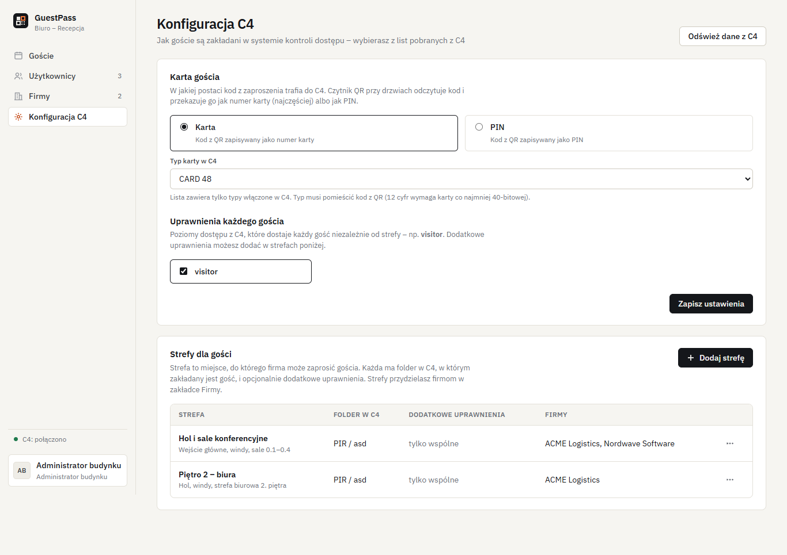
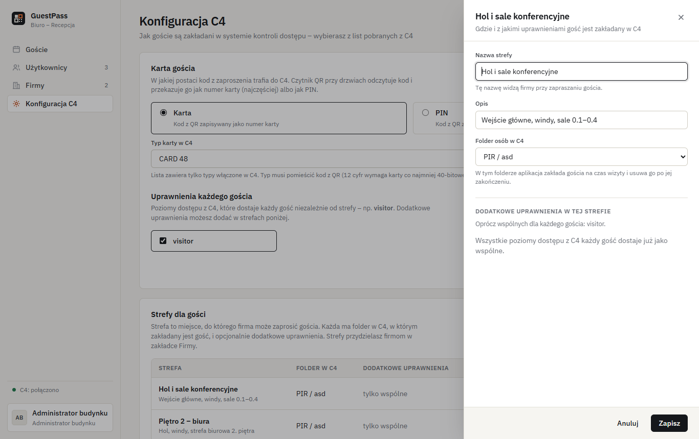
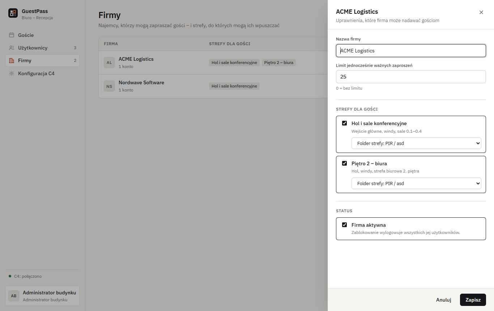
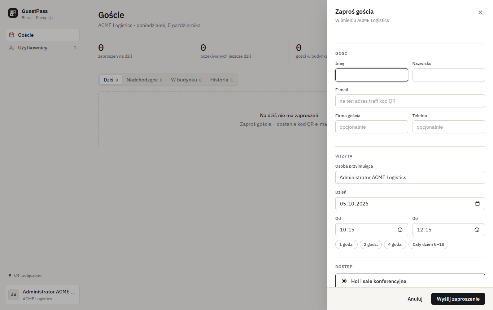

# GuestPass – instrukcja administratora budynku

Ta instrukcja jest dla osoby, która w GuestPass zarządza budynkiem: ustawia współpracę z systemem
kontroli dostępu **Gamanet C4**, dodaje firmy-najemców i ich konta. Nie wymaga znajomości programowania
ani identyfikatorów (GUID) z C4 – wszystko wybierasz z list.

Zawartość:

1. [Jak to działa w skrócie](#1-jak-to-działa-w-skrócie)
2. [Zanim zaczniesz – co musi być w C4](#2-zanim-zaczniesz--co-musi-być-w-c4)
3. [Pierwsza konfiguracja krok po kroku](#3-pierwsza-konfiguracja-krok-po-kroku)
4. [Konfiguracja C4 – opis ekranu](#4-konfiguracja-c4--opis-ekranu)
5. [Firmy i ich strefy](#5-firmy-i-ich-strefy)
6. [Konta użytkowników](#6-konta-użytkowników)
7. [Codzienna praca recepcji](#7-codzienna-praca-recepcji)
8. [Gdy coś nie działa](#8-gdy-coś-nie-działa)

---

## 1. Jak to działa w skrócie

1. Pracownik firmy zaprasza gościa w GuestPass i wybiera **strefę** (np. „Hol i sale konferencyjne”).
2. Gość dostaje e-mailem **kod QR**. Kod jest jego „kartą”.
3. 30 minut przed wizytą GuestPass **zakłada gościa w C4**: osobę w folderze strefy, z uprawnieniami
   (poziomami dostępu) i kartą o numerze z kodu QR.
4. Gość przykłada telefon z kodem do czytnika QR przy drzwiach – C4 otwiera drzwi jak dla zwykłej karty.
5. 30 minut po wizycie (albo od razu po kliknięciu *Wyszedł* / *Cofnij dostęp*) GuestPass **usuwa gościa
   z C4** – kod przestaje działać.

Poza oknem wizyty gościa w C4 po prostu nie ma, więc kod QR nic nie otworzy.

## 2. Zanim zaczniesz – co musi być w C4

Te rzeczy przygotowuje administrator C4 w kliencie C4 (jednorazowo):

| Co | Po co | Przykład |
|---|---|---|
| **Folder osób dla gości** | Tu GuestPass zakłada gości. Może być jeden wspólny albo osobny dla każdej strefy/firmy. | `PIR / asd`, `Goście / Hol` |
| **Poziom dostępu dla gości** | Określa, które drzwi i w jakich godzinach otwiera kod gościa. | `visitor` |
| **Włączony typ karty** | W tym formacie zapisywany jest numer z kodu QR. Kod ma 12 cyfr, więc typ karty musi być co najmniej **40-bitowy** (np. 48-bitowy). | `CARD 48` |
| **Konto techniczne dla GuestPass** | Konto, którym GuestPass loguje się do C4 (podaje je instalator w konfiguracji serwera). | `support`, `svc-guestpass` |
| **Czytniki QR przy drzwiach** | Odczytują kod z telefonu i przekazują go do C4 jak numer karty. | 2N Access Unit QR |

> **Ważne:** w C4 poziomu dostępu nie da się przypisać do folderu (klient C4 zgłasza wtedy błąd
> `AssignPersonToAccessLevel … InvalidObject`). Nie trzeba – GuestPass przypisuje poziom dostępu każdemu
> gościowi osobno i zdejmuje go razem z usunięciem gościa.

## 3. Pierwsza konfiguracja krok po kroku

1. Zaloguj się kontem administratora budynku (przy pierwszym logowaniu ustawisz własne hasło).
2. Wejdź w **Konfiguracja C4** (menu po lewej). Na dole menu powinno być widać **„C4: połączono”**.
3. W sekcji **Karta gościa** zostaw **Karta** i wybierz typ karty, np. **CARD 48**.
4. W sekcji **Uprawnienia każdego gościa** zaznacz poziom dostępu dla gości, np. **visitor**.
   Kliknij **Zapisz ustawienia**.
5. W sekcji **Strefy dla gości** popraw lub usuń strefy przykładowe i dodaj własne (**Dodaj strefę**):
   nazwa, opis, **folder osób w C4** z listy.
6. Wejdź w **Firmy**, dodaj firmę i zaznacz strefy, do których może zapraszać gości.
7. Wejdź w **Użytkownicy**, dodaj administratora firmy – przekaż mu login i hasło tymczasowe.
8. Na próbę zaproś siebie jako gościa na najbliższą godzinę i sprawdź w kliencie C4, że w folderze
   strefy pojawiła się osoba z poziomem dostępu i kartą. Potem w GuestPass kliknij *Cofnij dostęp*.

## 4. Konfiguracja C4 – opis ekranu

### Karta gościa

* **Karta** – kod z QR jest zapisywany w C4 jako numer karty. To typowe ustawienie dla czytników QR.
* **PIN** – kod z QR jest zapisywany jako PIN (dla czytników, które przekazują kod jako PIN).
* **Typ karty w C4** – lista zawiera tylko typy **włączone** w C4. Opcja *Automatycznie* wybiera pierwszy
  włączony typ – lepiej wskazać typ jawnie, gdy w C4 jest ich kilka.

### Uprawnienia każdego gościa

Poziomy dostępu, które dostaje **każdy** gość, niezależnie od strefy (np. `visitor` – hol i windy).

### Strefy dla gości

Strefa to „miejsce”, które firma wybiera przy zapraszaniu. Każda strefa ma:

* **Nazwę i opis** – widzą je firmy (np. „Piętro 2 – biura”, „Hol, windy, biuro 2.07”).
* **Folder osób w C4** – gdzie zakładany jest gość.
* **Dodatkowe uprawnienia** – poziomy dostępu nadawane tylko w tej strefie (np. `Parking` dla strefy
  „Parking podziemny”). Poziomy wspólne nie są tu pokazywane – każdy gość i tak je ma.

Strefę edytujesz lub usuwasz przyciskiem **⋯** w wierszu. Strefy przydzielonej jakiejś firmie nie da się
usunąć – najpierw odbierz ją firmie w zakładce *Firmy*.

### Odśwież dane z C4

Pobiera z C4 aktualne listy folderów, poziomów dostępu i typów kart. Użyj po zmianach w kliencie C4
(np. nowy folder albo nowy poziom dostępu).

### Czerwone oznaczenia

* **„nie ma w C4 (…1234)”** przy folderze lub uprawnieniu – w C4 nie ma już takiego elementu (usunięty,
  zmieniony albo to wartość przykładowa). Wybierz właściwy z listy.
* **Ramka „Do poprawy”** u góry – lista rzeczy, które trzeba poprawić, żeby zakładanie gości działało.

## 5. Firmy i ich strefy

W zakładce **Firmy** dodajesz najemców i zaznaczasz strefy, do których mogą zapraszać gości.
Przy każdej strefie możesz wybrać **osobny folder w C4 dla tej firmy** (np. `Goście / ACME`) –
domyślnie używany jest folder strefy.

* **Limit jednocześnie ważnych zaproszeń** – ochrona przed nadużyciem (0 = bez limitu).
* **Firma aktywna** – odznaczenie blokuje firmę i wylogowuje wszystkich jej użytkowników.

## 6. Konta użytkowników

| Rola | Może |
|---|---|
| Administrator budynku | wszystko: konfiguracja C4, firmy, konta wszystkich firm, wszystkie wizyty |
| Administrator firmy | konta swojej firmy, zapraszanie gości, wizyty swojej firmy |
| Pracownik | zapraszanie gości, wizyty swojej firmy |

Nowe konto dostaje **hasło tymczasowe** (pokazywane raz) – przy pierwszym logowaniu trzeba je zmienić.
*Resetuj hasło* w menu konta generuje nowe hasło tymczasowe.

## 7. Codzienna praca recepcji

* **Zaproś gościa** (klawisz `N`) – dane gościa, dzień i godziny, strefa. Kod QR trafia do gościa e-mailem.

  

* **Przyszedł / Wyszedł** – rejestracja wejścia i wyjścia. *Wyszedł* od razu usuwa kod z C4.
* **⋯ → Cofnij dostęp** – natychmiast usuwa gościa z C4 (np. zgubiony lub przekazany kod).
* **⋯ → Pokaż kod QR / Wyślij e-mail ponownie** – gdy gość nie ma maila.

## 8. Gdy coś nie działa

| Objaw | Przyczyna | Co zrobić |
|---|---|---|
| Na dole menu **„C4: błąd”** | Brak połączenia z C4 albo coś w konfiguracji nie istnieje w C4 | Wejdź w *Konfiguracja C4* – ramka *Do poprawy* mówi, co poprawić. Brak połączenia: sprawdź, czy działa usługa *C4 Application Server*, i zgłoś instalatorowi. |
| Wizyta ze statusem **„Błąd C4”** | C4 odrzucił zakładanie gościa | *⋯ → Szczegóły problemu*. GuestPass ponawia próbę co 30 s (do 10 razy). |
| „…invalid or disabled CardTypeId…” | Wybrany typ karty jest wyłączony w C4 | Włącz typ karty w C4 albo wybierz inny w *Konfiguracji C4*. |
| „…brak włączonych typów kart…” | W C4 nie ma żadnego włączonego typu karty | Włącz typ karty (min. 40-bitowy) w C4 albo wybierz *PIN*. |
| „…duplicate card codes…” | Taki numer karty już istnieje w C4 | Cofnij dostęp i wyślij nowe zaproszenie (nowy kod). |
| Kod QR nie otwiera drzwi, a wizyta jest *Kod aktywny* | Poziom dostępu nie obejmuje tych drzwi albo czytnik wysyła inny format | Sprawdź w kliencie C4 osobę gościa: czy ma poziom dostępu (np. `visitor`) i kartę; sprawdź drzwi w poziomie dostępu i ustawienia czytnika QR. |
| Firma nie widzi strefy przy zapraszaniu | Strefa nie jest przydzielona firmie | *Firmy* → firma → zaznacz strefę. |
| Na liście folderów brak nowego folderu | Lista z C4 jest pobierana przy wejściu na stronę | *Konfiguracja C4* → **Odśwież dane z C4**. |
