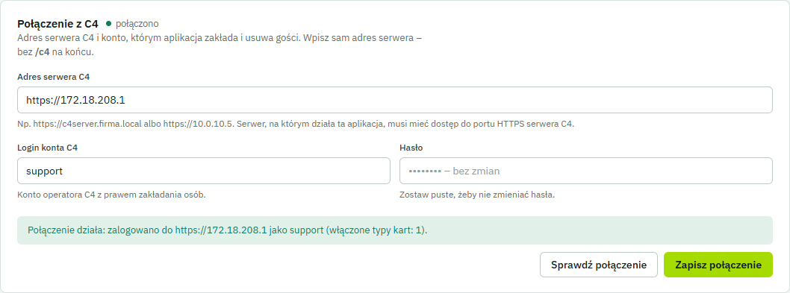

# GuestPass na serwerze Linux – wdrożenie krok po kroku

GuestPass działa na zdalnym serwerze Linux i jest obsługiwany wyłącznie przez przeglądarkę. Z serwerem C4
łączy się przez sieć (HTTPS), więc nie musi stać na tym samym komputerze co C4 ani na Windows.

```
 przeglądarka (recepcja, firmy)                 serwer Linux                         serwer C4 (Windows)
 ─────────────────────────────── HTTPS 443 ──▶  Caddy ─▶ GuestPass (:8080) ─ HTTPS 443 ─▶  C4 Application Server
                                                 └ SQLite, klucze: /var/lib/c4guestpass           (/c4/sapi)
 gość ◀── e-mail z kodem QR ── SMTP ◀──────────────┘
```

Sprawdzone: Ubuntu 24.04 (systemd) ↔ C4 2024 (serwer 21.0). Pełny cykl działa: zaproszenie, gość w C4 (folder, poziom
`visitor`, karta CARD 48), cofnięcie dostępu i usunięcie z C4. Połączenie z C4 ustawia się w przeglądarce, a po
restarcie usługi działa dalej.

Zawartość:

1. [Wymagania](#1-wymagania)
2. [Zbudowanie paczki (Windows z C4 SDK)](#2-zbudowanie-paczki-windows-z-c4-sdk)
3. [Instalacja na serwerze](#3-instalacja-na-serwerze)
4. [Pierwsze logowanie i połączenie z C4 (w przeglądarce)](#4-pierwsze-logowanie-i-połączenie-z-c4-w-przeglądarce)
5. [Poczta (SMTP)](#5-poczta-smtp)
6. [Aktualizacja, kopia zapasowa, przeniesienie](#6-aktualizacja-kopia-zapasowa-przeniesienie)
7. [Wariant: Docker](#7-wariant-docker)
8. [Gdy coś nie działa](#8-gdy-coś-nie-działa)

---

## 1. Wymagania

| Co | Szczegóły |
|---|---|
| Serwer | Linux x64 z systemd: Ubuntu 22.04/24.04, Debian 12 (inne dystrybucje działają, ale instalator używa `apt`). 1 vCPU, 1 GB RAM, 2 GB dysku wystarczą. **.NET nie trzeba instalować** – paczka go zawiera. |
| Sieć: serwer → C4 | Serwer GuestPass musi łączyć się z serwerem C4 po **HTTPS (port 443)**. Test z serwera: `curl -k https://ADRES-C4/c4/sapi/auth/keepalive` musi zwrócić kod **401** (serwer C4 żyje i czeka na logowanie). Brak odpowiedzi oznacza zablokowany ruch: sprawdź zaporę Windows na serwerze C4 i zapory w sieci. |
| Sieć: użytkownicy → serwer | Port 443 (oraz 80 dla certyfikatu Let's Encrypt). |
| Nazwa DNS | Np. `guestpass.firma.pl` wskazująca na serwer. Domena publiczna daje automatyczny certyfikat Let's Encrypt. Dla domeny wewnętrznej użyj `--internal-tls`. |
| Konto w C4 | Operator C4 z prawem zakładania osób w folderach gości (np. `svc-guestpass`). |
| Poczta | Konto SMTP do wysyłki zaproszeń. |

> Certyfikat serwera C4 może być samopodpisany (np. `CN=c4server`). SDK Gamanet go akceptuje i nie trzeba
> niczego importować na serwer Linux.

## 2. Zbudowanie paczki (Windows z C4 SDK)

Paczkę buduje się na komputerze z Windows, na którym jest zainstalowane **Gamanet C4 SDK** (`C:\Program Files (x86)\Gamanet\C4 SDK`)
oraz .NET 8 SDK. W katalogu repozytorium uruchom:

```powershell
powershell -ExecutionPolicy Bypass -File deploy\build-linux.ps1
```

Wynik to plik `dist\c4guestpass-linux-x64.tar.gz` (ok. 50 MB): program, instalator, usługa systemd i wzór konfiguracji.

> Paczka zawiera licencjonowane biblioteki Gamanet C4 SDK. Nie publikuj jej poza firmą (katalog `dist/` jest w `.gitignore`).

## 3. Instalacja na serwerze

Skopiuj paczkę na serwer (np. `scp dist\c4guestpass-linux-x64.tar.gz admin@serwer:`) i na serwerze uruchom:

```bash
tar xzf c4guestpass-linux-x64.tar.gz
cd c4guestpass-linux-x64
sudo bash install.sh --domain guestpass.firma.pl                    # domena publiczna: certyfikat Let's Encrypt
# albo
sudo bash install.sh --domain guestpass.firma.local --internal-tls  # sieć wewnętrzna: certyfikat z CA Caddy
```

Instalator:

* tworzy użytkownika systemowego `c4guestpass` (bez logowania);
* kopiuje program do `/opt/c4guestpass`;
* zakłada katalog danych `/var/lib/c4guestpass` (prawa `700`; baza, klucze szyfrujące, kopie poczty);
* przy pierwszej instalacji tworzy konfigurację `/etc/c4guestpass/c4guestpass.env` (prawa `600`);
* uruchamia usługę `c4guestpass` (start razem z systemem, restart po awarii);
* instaluje **Caddy** i ustawia HTTPS dla podanej domeny.

Na końcu wypisuje adres aplikacji i **hasło tymczasowe administratora**.

| Sytuacja | Co zrobić |
|---|---|
| Na serwerze jest już nginx / Apache (porty 80/443 zajęte) | Instalator zatrzyma się z komunikatem, a aplikacja i tak działa na `http://127.0.0.1:8080`. Dołącz ją do istniejącego serwera WWW według wzoru `nginx.conf` z paczki. |
| Test bez domeny | `sudo bash install.sh` – aplikacja na `http://ADRES-SERWERA:8080`, **bez HTTPS** (hasła idą jawnym tekstem). Tylko do prób w zaufanej sieci. |
| Certyfikat `--internal-tls` | Przeglądarki nie znają CA Caddy. Certyfikat główny (`/var/lib/caddy/.local/share/caddy/pki/authorities/local/root.crt`) zainstaluj na komputerach recepcji (np. przez GPO) albo użyj własnego certyfikatu firmy: w `/etc/caddy/c4guestpass.caddy` zamień `tls internal` na `tls /etc/caddy/guestpass.crt /etc/caddy/guestpass.key` (pliki czytelne dla użytkownika `caddy`), potem `sudo systemctl reload caddy`. |
| Zapora na serwerze (ufw) | `sudo ufw allow 80,443/tcp` |

## 4. Pierwsze logowanie i połączenie z C4 (w przeglądarce)

1. Otwórz `https://guestpass.firma.pl` i zaloguj się jako **admin** hasłem tymczasowym z instalatora.
   Ustaw własne hasło. Gdy hasło zginie, odczytasz je z logu: `sudo journalctl -u c4guestpass | grep -i "hasło tymczasowe"`.
2. Wejdź w **Konfiguracja C4** → sekcja **Połączenie z C4**:
   * **Adres serwera C4**: adres serwera C4 widziany z serwera Linux, np. `https://c4server.firma.local` albo `https://10.0.10.5`.
     Wystarczy sam adres; dopisek `/c4` aplikacja usunie sama.
   * **Login** i **hasło** konta C4.
   * Kliknij **Sprawdź połączenie**. Zielony komunikat „Połączenie działa…” oznacza, że wszystko jest dobrze.
     Inaczej komunikat powie, co poprawić: złe hasło, brak dostępu do serwera albo zły adres.
   * Kliknij **Zapisz połączenie**.
3. Dalej postępuj jak w [instrukcji administratora](INSTRUKCJA-ADMINISTRATORA.md#3-pierwsza-konfiguracja-krok-po-kroku):
   typ karty (CARD 48), uprawnienie **visitor**, strefy z folderem (np. *PIR / asd*), firmy, konta.



Hasło C4 jest zapisane w bazie **zaszyfrowane** kluczem z `/var/lib/c4guestpass/keys` i nigdy nie wraca do przeglądarki.
Połączenie zapisane w aplikacji ma pierwszeństwo przed wartościami `C4__*` z pliku konfiguracji.

## 5. Poczta (SMTP)

Ustawienia poczty są w pliku `/etc/c4guestpass/c4guestpass.env`:

```bash
sudo nano /etc/c4guestpass/c4guestpass.env
#   Mail__Mode=Smtp
#   Mail__Host=smtp.firma.pl
#   Mail__Port=587
#   Mail__User=recepcja@firma.pl
#   Mail__Password='hasło'          # znaki specjalne – w apostrofach
#   Mail__FromAddress=recepcja@firma.pl
sudo systemctl restart c4guestpass
```

Do testów bez SMTP: `Mail__Mode=Pickup`. Wiadomości trafią wtedy jako pliki `.eml` do `/var/lib/c4guestpass/mail`.

## 6. Aktualizacja, kopia zapasowa, przeniesienie

**Aktualizacja:** zbuduj nową paczkę i na serwerze uruchom ten sam instalator:

```bash
tar xzf c4guestpass-linux-x64.tar.gz && cd c4guestpass-linux-x64 && sudo bash install.sh
```

Program zostanie podmieniony. Dane, konfiguracja, ustawienia z przeglądarki i Caddy zostają bez zmian.

**Kopia zapasowa:** cały stan aplikacji jest w `/var/lib/c4guestpass` (baza oraz klucze `keys/`) i w `/etc/c4guestpass`:

```bash
sudo systemctl stop c4guestpass
sudo tar czf guestpass-backup-$(date +%F).tgz /var/lib/c4guestpass /etc/c4guestpass
sudo systemctl start c4guestpass
```

> Bez katalogu `keys/` kopia jest niepełna. Po odtworzeniu bez kluczy wszyscy zostaną wylogowani,
> a hasło C4 trzeba będzie wpisać ponownie w Konfiguracji C4.
> Kopia zawiera dane osobowe gości (RODO) – przechowuj ją bezpiecznie.

**Przeniesienie na nowy serwer:** zainstaluj paczkę, zatrzymaj usługę, rozpakuj kopię do `/` i nadaj właściciela
(`sudo chown -R c4guestpass: /var/lib/c4guestpass`), a potem uruchom usługę.

**Usunięcie:** `sudo bash install.sh --uninstall` (dane zostają) albo `--uninstall --purge` (wszystko).

**Codzienna obsługa:**

| Polecenie | Do czego |
|---|---|
| `systemctl status c4guestpass` | czy działa |
| `journalctl -u c4guestpass -f` | log na żywo |
| `sudo systemctl restart c4guestpass` | restart (np. po zmianie pliku `.env`) |

## 7. Wariant: Docker

Jeśli na serwerze jest Docker:

1. Na Windows z C4 SDK skopiuj pakiety SDK do repozytorium: `powershell -ExecutionPolicy Bypass -File deploy\prepare-c4-sdk.ps1`
   (trafią do `deploy/c4-sdk/`, katalog jest w `.gitignore`).
2. Skopiuj repozytorium razem z `deploy/c4-sdk/` na serwer.
3. Na serwerze:

   ```bash
   cd deploy
   cp .env.example .env                       # ustaw C4_SDK_VERSION=2024, GUESTPASS_DOMAIN, ACME_EMAIL
   cp appsettings.Production.example.json appsettings.Production.json
   docker compose --profile https up -d --build
   docker compose logs app | grep -i "hasło tymczasowe"
   ```

4. Połączenie z C4 ustaw w przeglądarce jak w pkt 4. Dane i klucze są w wolumenie `guestpass-data`.

## 8. Gdy coś nie działa

| Objaw | Co sprawdzić |
|---|---|
| „Brak połączenia z serwerem C4…” / „nie odpowiada w ciągu 20 s” | Z serwera Linux: `curl -k https://ADRES-C4/c4/sapi/auth/keepalive` musi dać `401`. Brak odpowiedzi oznacza zaporę: na serwerze C4 zezwól na ruch przychodzący 443 z adresu serwera GuestPass. Sprawdź też, czy nazwa serwera C4 rozwiązuje się z Linuksa (`getent hosts c4server.firma.local`); jeśli nie, wpisz adres IP. |
| „C4 odrzucił logowanie…” | Login lub hasło konta C4; czy konto nie jest zablokowane w C4. |
| „Wersja serwera C4 nie pasuje do wersji SDK” | Adres z dopiskiem innej ścieżki niż `/c4` albo paczka zbudowana dla innej wersji C4 (C4 2024 = `-C4SdkVersion 2024`). |
| Strona się nie otwiera | `systemctl status c4guestpass caddy`, `journalctl -u c4guestpass -n 50`. |
| Logowanie „nic nie robi” przy dostępie przez `http://` | Ciasteczko wymaga HTTPS. Używaj adresu `https://…` albo przy dostępie bez HTTPS ustaw `GuestPass__SecureCookies=false` w `.env`. |
| Po przeniesieniu serwera: „wpisz hasło ponownie” w logu | Nie przeniesiono katalogu `keys/`. Wpisz hasło C4 ponownie w Konfiguracji C4 → Połączenie z C4. |
| Gość nie dostaje e-maila | Ustawienia `Mail__*` w `.env` i log (`journalctl -u c4guestpass | grep -i mail`). |
